# Markdown dialects: Kerebron vs GFM, Marked and Pandoc

How `@kerebron/extension-markdown` reads and writes Markdown compared with the
renderers people check against. The [results](#results) are generated, so they
can be refreshed after every parser or serializer change and reviewed with
`git diff`.

## Running the comparison

```sh
deno task markdown:dialects                  # regenerate the results below
deno task markdown:dialects --md '~x~ ~~y~~' # compare one snippet in the terminal
```

Requires `pandoc` on `PATH` (`brew install pandoc`). Samples live in
[cases.ts](../utils/markdown-dialects/cases.ts); add one whenever you change how
a construct is handled.

| Column         | Renderer                                                                                          |
| -------------- | ------------------------------------------------------------------------------------------------- |
| **Kerebron**   | `saveDocument('text/html')` after `loadDocumentText('text/x-markdown', …)` with `BrowserLessEditorKit` |
| **Saved as**   | `saveDocument('text/x-markdown')`; `✓` = unchanged. ⚠️ when reloading it renders differently        |
| **GFM**        | `micromark` + `micromark-extension-gfm` — spec-accurate GFM, used as the GFM reference             |
| **Marked**     | `marked` with default options (`gfm: true`)                                                       |
| **Pandoc GFM** | `pandoc -f gfm --mathml`                                                                          |
| **Pandoc**     | `pandoc -f markdown --mathml` — Pandoc's own dialect with its default extensions                  |

Before comparing, every output goes through `normalizeHtml()` in
[compare.ts](../utils/markdown-dialects/compare.ts). It ignores markup style and
keeps content:
- `<strike>` and `<s>` are treated as `<del>`, and `<b>`/`<i>` as
  `<strong>`/`<em>`.
- Wrapper tags (`p`, `div`, `span`, `thead`, …) are dropped.
- Only meaningful attributes are kept (`href`, `src`, `alt`, `title`, `start`,
  `checked`, alignment).
- The order of nested marks is ignored, so `<strong><em>x</em></strong>` equals
  `<em><strong>x</strong></em>`.
- Any `<math>` element counts as the same math.
- `<wbr>`, which Kerebron's HTML export uses for soft line breaks, counts as
  whitespace.
- `Error: Unhandled … node type: X` becomes `⚠unhandled:X`.

## How Kerebron decides what a tilde means

```mermaid
flowchart LR
  Source["Markdown source"] --> Grammar["tree-sitter-markdown-inline<br/>(vendor/tree-sitter-markdown)"]
  Grammar -->|"strikethrough / subscript /<br/>superscript / highlight nodes"| Tokenizer["treeSitterTokenizer.ts<br/>WRAPPING_INLINE_NODES"]
  Tokenizer -->|"*_open / *_close tokens"| MdToPm["mdToPmConverter.ts<br/>token → mark"]
  MdToPm --> Doc["ProseMirror doc<br/>strike · subscript · superscript · highlight"]
  Doc --> PmToMd["pmToMdConverter.ts<br/>mark → token"]
  PmToMd --> Handlers["inline_token_handlers.ts<br/>delimiterHandlers()"]
  Handlers --> Output["Markdown output<br/>~~ · ~ · ^ · =="]

  classDef grammar fill:#fde68a,stroke:#b45309
  class Grammar grammar
```



- **The grammar decides the meaning.** The vendored fork
  (`mieweb/tree-sitter-markdown@kerebron`) follows Pandoc: `~~x~~` is
  strikethrough, `~x~` is subscript, `^x^` is superscript and `==x==` is
  highlight.
- **Unknown node types become error text.** The tokenizer maps grammar nodes
  through `WRAPPING_INLINE_NODES` in
  [treeSitterTokenizer.ts](../packages/extension-markdown/src/treeSitterTokenizer.ts).
  Any node type it does not know falls into `default:`, which writes an
  `Error: Unhandled … node type` string into the document. That string is also
  saved back to the file.
- **Saving uses fixed delimiters.** The serializer writes `~~`, `~`, `^` and
  `==` (`delimiterHandlers()` in
  [inline_token_handlers.ts](../packages/extension-markdown/src/token_handlers/inline_token_handlers.ts)).

### The `~x~` dialect question

No single choice matches every renderer:

| `~x~` means…  | Who                                                                                                  |
| ------------- | ---------------------------------------------------------------------------------------------------- |
| strikethrough | GFM spec ("one or two tildes"), GitHub, Marked, Kerebron before `4a3f79f`                            |
| subscript     | Pandoc Markdown (`subscript` extension), Kerebron since `4a3f79f`                                    |
| literal text  | Pandoc GFM (requires `~~`)                                                                           |

`~~x~~` is strikethrough in every renderer, so Kerebron saves strikethrough
that way.

Two consequences follow from that choice:
- **On GitHub and in Marked:** a subscript Kerebron saves (`H~2~O`) shows as
  strikethrough.
- **Older files:** files saved before `4a3f79f` used `~text~` for
  strikethrough, so they now load as subscript.

## Results

<!-- results:start -->

_Generated by [compare.ts](../utils/markdown-dialects/compare.ts) from `37437cb` with pandoc 3.5, marked 16.4.2, micromark 4.0.2 + micromark-extension-gfm 3.0.0. Do not edit by hand._

### Summary

| Reference | Samples where Kerebron matches |
| --- | --- |
| GFM | 34 / 65 |
| Marked | 34 / 65 |
| Pandoc GFM | 35 / 65 |
| Pandoc | 37 / 65 |

**Follows Pandoc instead of GFM (10):** <code>~strike~</code>, <code>H~2~O</code>, <code>~a b~</code>, <code>~a\ b~</code>, <code>~a.~ b</code>, <code>~$5~</code>, <code>x^2^</code>, <code>$x^2$</code>, <code>see https://example.com now</code>, <code>see www.example.com now</code>

**Matches neither GFM nor Pandoc (21):** <code>x ~~~a~~~ y</code>, <code>\~not\~</code>, <code>&lt;del&gt;d&lt;/del&gt; &lt;s&gt;s&lt;/s&gt; &lt;strike&gt;k&lt;/strike&gt;</code>, <code>_em_ and __strong__</code>, <code>==mark==</code>, <code>costs $5 and $10</code>, <code>[span]{.note}</code>, <code>[t](http://x.com "title")</code>, <code>[t][r]⏎⏎[r]: http://x.com⏎</code>, <code>see &lt;https://example.com&gt; now</code>, <code>&lt;a@b.co&gt;</code>, <code></code>, <code>text[^1]⏎⏎[^1]: note⏎</code>, <code>text^[inline note]</code>, <code>see [@doe99]</code>, <code>Title⏎=====⏎⏎after⏎</code>, <code>Sub⏎---⏎⏎after⏎</code>, <code>```js⏎x = 1⏎```</code>, <code>- [ ] todo⏎- [x] done⏎</code>, <code>&#124; a &#124; b &#124;⏎&#124;---&#124;:-:&#124;⏎&#124; 1 &#124; 2 &#124;⏎</code>, <code>{{ toc }}</code>

**Renders differently after save and reload (5):** <code>~~~js⏎x = 1⏎~~~⏎</code>, <code>~~~~⏎has ~~~ inside⏎~~~~⏎</code>, <code>[t](http://x.com "title")</code>, <code>[t][r]⏎⏎[r]: http://x.com⏎</code>, <code>```js⏎x = 1⏎```</code>

### Pandoc extensions (24 samples where Pandoc differs from GFM)

| Input | GFM | Pandoc | Kerebron | Kerebron follows |
| --- | --- | --- | --- | --- |
| <code>~strike~</code> | <code>&lt;del&gt;strike&lt;/del&gt;</code> | <code>&lt;sub&gt;strike&lt;/sub&gt;</code> | <code>&lt;sub&gt;strike&lt;/sub&gt;</code> | Pandoc ✅ |
| <code>H~2~O</code> | <code>H&lt;del&gt;2&lt;/del&gt;O</code> | <code>H&lt;sub&gt;2&lt;/sub&gt;O</code> | <code>H&lt;sub&gt;2&lt;/sub&gt;O</code> | Pandoc ✅ |
| <code>~a b~</code> | <code>&lt;del&gt;a b&lt;/del&gt;</code> | <code>~a b~</code> | <code>~a b~</code> | Pandoc ✅ |
| <code>~a\ b~</code> | <code>&lt;del&gt;a\ b&lt;/del&gt;</code> | <code>&lt;sub&gt;a b&lt;/sub&gt;</code> | <code>&lt;sub&gt;a b&lt;/sub&gt;</code> | Pandoc ✅ |
| <code>~a.~ b</code> | <code>&lt;del&gt;a.&lt;/del&gt; b</code> | <code>&lt;sub&gt;a.&lt;/sub&gt; b</code> | <code>&lt;sub&gt;a.&lt;/sub&gt; b</code> | Pandoc ✅ |
| <code>~$5~</code> | <code>&lt;del&gt;$5&lt;/del&gt;</code> | <code>&lt;sub&gt;$5&lt;/sub&gt;</code> | <code>&lt;sub&gt;$5&lt;/sub&gt;</code> | Pandoc ✅ |
| <code>x ~~~a~~~ y</code> | <code>x ~~~a~~~ y</code> | <code>x ~&lt;del&gt;a&lt;/del&gt;~ y</code> | <code>x &lt;del&gt;~a&lt;/del&gt;~ y</code> | neither ❌ |
| <code>~~a~ b</code> | <code>~~a~ b</code> | <code>~&lt;sub&gt;a&lt;/sub&gt; b</code> | <code>~~a~ b</code> | GFM |
| <code>&lt;del&gt;d&lt;/del&gt; &lt;s&gt;s&lt;/s&gt; &lt;strike&gt;k&lt;/strike&gt;</code> | <code>&lt;del&gt;d&lt;/del&gt; &lt;del&gt;s&lt;/del&gt; &lt;del&gt;k&lt;/del&gt;</code> | <code>&lt;del&gt; d &lt;/del&gt; &lt;del&gt;s&lt;/del&gt; &lt;del&gt;k&lt;/del&gt;</code> | <code>d s &lt;del&gt;k&lt;/del&gt;</code> | neither ❌ |
| <code>x^2^</code> | <code>x^2^</code> | <code>x&lt;sup&gt;2&lt;/sup&gt;</code> | <code>x&lt;sup&gt;2&lt;/sup&gt;</code> | Pandoc ✅ |
| <code>$x^2$</code> | <code>$x^2$</code> | <code>&lt;math&gt;</code> | <code>&lt;math&gt;</code> | Pandoc ✅ |
| <code>"quotes" -- dash --- ...</code> | <code>"quotes" -- dash --- ...</code> | <code>“quotes” – dash — …</code> | <code>"quotes" -- dash --- ...</code> | GFM |
| <code>[span]{.note}</code> | <code>[span]{.note}</code> | <code>span</code> | <code>&lt;a href=""&gt;span&lt;/a&gt;{.note}</code> | neither ❌ |
| <code>see https://example.com now</code> | <code>see &lt;a href="https://example.com"&gt;https://example.com&lt;/a&gt; n…</code> | <code>see https://example.com now</code> | <code>see https://example.com now</code> | Pandoc ✅ |
| <code>see www.example.com now</code> | <code>see &lt;a href="http://www.example.com"&gt;www.example.com&lt;/a&gt; now</code> | <code>see www.example.com now</code> | <code>see www.example.com now</code> | Pandoc ✅ |
| <code></code> | <code>&lt;img src="i.png" alt="alt" title="t"&gt;</code> | <code>&lt;img src="i.png" title="t" alt="alt"&gt; alt</code> | <code>&lt;img title=""t"" src="i.png"&gt;</code> | neither ❌ |
| <code>text[^1]⏎⏎[^1]: note⏎</code> | <code>text&lt;sup&gt;&lt;a href="#"&gt;1&lt;/a&gt;&lt;/sup&gt;&lt;h2&gt;Footnotes&lt;/h2&gt;&lt;ol&gt;&lt;li&gt;n…</code> | <code>text&lt;a href="#"&gt;&lt;sup&gt;1&lt;/sup&gt;&lt;/a&gt;&lt;hr&gt;&lt;ol&gt;&lt;li&gt;note&lt;a href="#"…</code> | <code>text&lt;a href=""&gt;^1&lt;/a&gt;&lt;pre&gt;&lt;code&gt;⚠unhandled:link_reference_d…</code> | neither ❌ |
| <code>text^[inline note]</code> | <code>text^[inline note]</code> | <code>text&lt;a href="#"&gt;&lt;sup&gt;1&lt;/sup&gt;&lt;/a&gt;&lt;hr&gt;&lt;ol&gt;&lt;li&gt;inline note&lt;a h…</code> | <code>text^&lt;a href=""&gt;inline note&lt;/a&gt;</code> | neither ❌ |
| <code># Title {#id}</code> | <code>&lt;h1&gt;Title {#id}&lt;/h1&gt;</code> | <code>&lt;h1&gt;Title&lt;/h1&gt;</code> | <code>&lt;h1&gt;Title {#id}&lt;/h1&gt;</code> | GFM |
| <code>- [ ] todo⏎- [x] done⏎</code> | <code>&lt;ul&gt;&lt;li&gt;&lt;input&gt; todo&lt;/li&gt;&lt;li&gt;&lt;input checked&gt; done&lt;/li&gt;&lt;/ul&gt;</code> | <code>&lt;ul&gt;&lt;li&gt;&lt;input&gt;todo&lt;/li&gt;&lt;li&gt;&lt;input checked&gt;done&lt;/li&gt;&lt;/ul&gt;</code> | <code>&lt;ul&gt;&lt;li&gt;&lt;input&gt; todo&lt;/li&gt;&lt;li&gt;&lt;input&gt; done&lt;/li&gt;&lt;/ul&gt;</code> | neither ❌ |
| <code>Term⏎: Definition⏎</code> | <code>Term : Definition</code> | <code>&lt;dl&gt;&lt;dt&gt;Term&lt;/dt&gt;&lt;dd&gt;Definition&lt;/dd&gt;&lt;/dl&gt;</code> | <code>Term : Definition</code> | GFM |
| <code>::: note⏎hi⏎:::⏎</code> | <code>::: note hi :::</code> | <code>hi</code> | <code>::: note hi :::</code> | GFM |
| <code>&#124; line one⏎&#124; line two⏎</code> | <code>&#124; line one &#124; line two</code> | <code>line one&lt;br&gt;line two</code> | <code>&#124; line one &#124; line two</code> | GFM |
| <code>(@) first⏎(@) second⏎</code> | <code>(@) first (@) second</code> | <code>&lt;ol&gt;&lt;li&gt;first&lt;/li&gt;&lt;li&gt;second&lt;/li&gt;&lt;/ol&gt;</code> | <code>(@) first (@) second</code> | GFM |

### All samples

`✓` means the same as Kerebron after normalization.

#### Tilde

| Input | Kerebron | Saved as | GFM | Marked | Pandoc GFM | Pandoc |
| --- | --- | --- | --- | --- | --- | --- |
| <code>~~strike~~</code><br>strikethrough everywhere | <code>&lt;del&gt;strike&lt;/del&gt;</code> | ✓ | ✓ | ✓ | ✓ | ✓ |
| <code>~strike~</code><br>GFM spec: one or two tildes; Pandoc: subscript | <code>&lt;sub&gt;strike&lt;/sub&gt;</code> | ✓ | <code>&lt;del&gt;strike&lt;/del&gt;</code> | <code>&lt;del&gt;strike&lt;/del&gt;</code> | <code>~strike~</code> | ✓ |
| <code>H~2~O</code><br>Pandoc subscript | <code>H&lt;sub&gt;2&lt;/sub&gt;O</code> | ✓ | <code>H&lt;del&gt;2&lt;/del&gt;O</code> | <code>H&lt;del&gt;2&lt;/del&gt;O</code> | <code>H~2~O</code> | ✓ |
| <code>~a b~</code><br>Pandoc subscript forbids unescaped spaces | <code>~a b~</code> | ✓ | <code>&lt;del&gt;a b&lt;/del&gt;</code> | <code>&lt;del&gt;a b&lt;/del&gt;</code> | ✓ | ✓ |
| <code>~a\ b~</code><br>Pandoc escaped space inside subscript | <code>&lt;sub&gt;a b&lt;/sub&gt;</code> | ✓ | <code>&lt;del&gt;a\ b&lt;/del&gt;</code> | <code>&lt;del&gt;a\ b&lt;/del&gt;</code> | <code>~a\ b~</code> | ✓ |
| <code>~a.~ b</code> | <code>&lt;sub&gt;a.&lt;/sub&gt; b</code> | ✓ | <code>&lt;del&gt;a.&lt;/del&gt; b</code> | <code>&lt;del&gt;a.&lt;/del&gt; b</code> | <code>~a.~ b</code> | ✓ |
| <code>~$5~</code> | <code>&lt;sub&gt;$5&lt;/sub&gt;</code> | ✓ | <code>&lt;del&gt;$5&lt;/del&gt;</code> | <code>&lt;del&gt;$5&lt;/del&gt;</code> | <code>~$5~</code> | ✓ |
| <code>x ~~~a~~~ y</code><br>GFM: three tildes never strike | <code>x &lt;del&gt;~a&lt;/del&gt;~ y</code> | ✓ | <code>x ~~~a~~~ y</code> | <code>x ~~~a~~~ y</code> | <code>x ~&lt;del&gt;a&lt;/del&gt;~ y</code> | <code>x ~&lt;del&gt;a&lt;/del&gt;~ y</code> |
| <code>~~a~ b</code><br>mismatched run lengths | <code>~~a~ b</code> | ✓ | ✓ | ✓ | ✓ | <code>~&lt;sub&gt;a&lt;/sub&gt; b</code> |
| <code>a~~b~~c</code><br>intraword | <code>a&lt;del&gt;b&lt;/del&gt;c</code> | ✓ | ✓ | ✓ | ✓ | ✓ |
| <code>~~**a**~~</code><br>nested marks | <code>&lt;del&gt;&lt;strong&gt;a&lt;/strong&gt;&lt;/del&gt;</code> | <code>**~~a~~**</code> | ✓ | ✓ | ✓ | ✓ |
| <code>~ a ~</code><br>space-flanked, not a delimiter | <code>~ a ~</code> | ✓ | ✓ | ✓ | ✓ | ✓ |
| <code>takes ~5 min to ~10 min</code><br>approximation prose | <code>takes ~5 min to ~10 min</code> | ✓ | ✓ | ✓ | ✓ | ✓ |
| <code>see ~/a and ~/b</code><br>home paths | <code>see ~/a and ~/b</code> | ✓ | ✓ | ✓ | ✓ | ✓ |
| <code>\~not\~</code><br>backslash escape | <code>\~not\~</code> | ✓ | <code>~not~</code> | <code>~not~</code> | <code>~not~</code> | <code>~not~</code> |
| <code>`a ~b~ c`</code><br>inside code span | <code>&lt;code&gt;a ~b~ c&lt;/code&gt;</code> | ✓ | ✓ | ✓ | ✓ | ✓ |
| <code>~~~js⏎x = 1⏎~~~⏎</code><br>tilde code fence | <code>&lt;pre&gt;&lt;code&gt;x = 1&lt;/code&gt;&lt;/pre&gt;</code> | <code>```js⏎x = 1⏎```</code> ⚠️ reloads differently | ✓ | ✓ | ✓ | ✓ |
| <code>~~~~⏎has ~~~ inside⏎~~~~⏎</code><br>longer fence | <code>&lt;pre&gt;&lt;code&gt;has ~~~ inside&lt;/code&gt;&lt;/pre&gt;</code> | <code>```⏎has ~~~ inside⏎```</code> ⚠️ reloads differently | ✓ | ✓ | ✓ | ✓ |
| <code>&lt;del&gt;d&lt;/del&gt; &lt;s&gt;s&lt;/s&gt; &lt;strike&gt;k&lt;/strike&gt;</code><br>HTML strike tags | <code>d s &lt;del&gt;k&lt;/del&gt;</code> | <code>d s ~~k~~</code> | <code>&lt;del&gt;d&lt;/del&gt; &lt;del&gt;s&lt;/del&gt; &lt;del&gt;k&lt;/del&gt;</code> | <code>&lt;del&gt;d&lt;/del&gt; &lt;del&gt;s&lt;/del&gt; &lt;del&gt;k&lt;/del&gt;</code> | <code>&lt;del&gt;d&lt;/del&gt; &lt;del&gt;s&lt;/del&gt; &lt;del&gt;k&lt;/del&gt;</code> | <code>&lt;del&gt; d &lt;/del&gt; &lt;del&gt;s&lt;/del&gt; &lt;del&gt;k&lt;/del&gt;</code> |
| <code>&lt;sub&gt;s&lt;/sub&gt;</code><br>HTML subscript | <code>&lt;sub&gt;s&lt;/sub&gt;</code> | <code>~s~</code> | ✓ | ✓ | ✓ | ✓ |

#### Inline

| Input | Kerebron | Saved as | GFM | Marked | Pandoc GFM | Pandoc |
| --- | --- | --- | --- | --- | --- | --- |
| <code>*em* and **strong**</code> | <code>&lt;em&gt;em&lt;/em&gt; and &lt;strong&gt;strong&lt;/strong&gt;</code> | ✓ | ✓ | ✓ | ✓ | ✓ |
| <code>_em_ and __strong__</code><br>GFM/Pandoc: em and strong | <code>&lt;u&gt;em&lt;/u&gt; and &lt;u&gt;strong&lt;/u&gt;</code> | <code>_em_ and _strong_</code> | <code>&lt;em&gt;em&lt;/em&gt; and &lt;strong&gt;strong&lt;/strong&gt;</code> | <code>&lt;em&gt;em&lt;/em&gt; and &lt;strong&gt;strong&lt;/strong&gt;</code> | <code>&lt;em&gt;em&lt;/em&gt; and &lt;strong&gt;strong&lt;/strong&gt;</code> | <code>&lt;em&gt;em&lt;/em&gt; and &lt;strong&gt;strong&lt;/strong&gt;</code> |
| <code>***both***</code> | <code>&lt;em&gt;&lt;strong&gt;both&lt;/strong&gt;&lt;/em&gt;</code> | ✓ | ✓ | ✓ | ✓ | ✓ |
| <code>snake_case_word</code><br>no intraword underscore emphasis | <code>snake_case_word</code> | ✓ | ✓ | ✓ | ✓ | ✓ |
| <code>foo*bar*baz</code><br>intraword star emphasis | <code>foo&lt;em&gt;bar&lt;/em&gt;baz</code> | ✓ | ✓ | ✓ | ✓ | ✓ |
| <code>x^2^</code><br>Pandoc superscript | <code>x&lt;sup&gt;2&lt;/sup&gt;</code> | ✓ | <code>x^2^</code> | <code>x^2^</code> | <code>x^2^</code> | ✓ |
| <code>^a b^</code><br>Pandoc superscript forbids unescaped spaces | <code>^a b^</code> | ✓ | ✓ | ✓ | ✓ | ✓ |
| <code>==mark==</code><br>Pandoc `mark` extension, off by default | <code>&lt;mark&gt;mark&lt;/mark&gt;</code> | ✓ | <code>==mark==</code> | <code>==mark==</code> | <code>==mark==</code> | <code>==mark==</code> |
| <code>$x^2$</code><br>Pandoc tex_math_dollars | <code>&lt;math&gt;</code> | ✓ | <code>$x^2$</code> | <code>$x^2$</code> | ✓ | ✓ |
| <code>costs $5 and $10</code><br>Pandoc: closing $ must not follow a space | <code>costs &lt;math&gt;10</code> | ✓ | <code>costs $5 and $10</code> | <code>costs $5 and $10</code> | <code>costs $5 and $10</code> | <code>costs $5 and $10</code> |
| <code>&lt;u&gt;u&lt;/u&gt;</code><br>raw HTML | <code>&lt;u&gt;u&lt;/u&gt;</code> | <code>_u_</code> | ✓ | ✓ | ✓ | ✓ |
| <code>&lt;sup&gt;2&lt;/sup&gt; &lt;mark&gt;m&lt;/mark&gt;</code><br>raw HTML | <code>&lt;sup&gt;2&lt;/sup&gt; &lt;mark&gt;m&lt;/mark&gt;</code> | <code>^2^ ==m==</code> | ✓ | ✓ | ✓ | ✓ |
| <code>"quotes" -- dash --- ...</code><br>Pandoc smart punctuation | <code>"quotes" -- dash --- ...</code> | ✓ | ✓ | ✓ | ✓ | <code>“quotes” – dash — …</code> |
| <code>&amp;copy; &amp;amp;</code><br>entities | <code>© &amp;</code> | <code>© &amp;</code> | ✓ | ✓ | ✓ | ✓ |
| <code>[span]{.note}</code><br>Pandoc bracketed_spans | <code>&lt;a href=""&gt;span&lt;/a&gt;{.note}</code> | ✓ | <code>[span]{.note}</code> | <code>[span]{.note}</code> | <code>[span]{.note}</code> | <code>span</code> |

#### Line breaks

| Input | Kerebron | Saved as | GFM | Marked | Pandoc GFM | Pandoc |
| --- | --- | --- | --- | --- | --- | --- |
| <code>a⏎b</code><br>soft break | <code>a b</code> | ✓ | ✓ | ✓ | ✓ | ✓ |
| <code>a  ⏎b</code><br>two-space hard break | <code>a&lt;br&gt;b</code> | ✓ | ✓ | ✓ | ✓ | ✓ |
| <code>a\⏎b</code><br>backslash hard break | <code>a&lt;br&gt;b</code> | <code>a  ⏎b</code> | ✓ | ✓ | ✓ | ✓ |

#### Links and images

| Input | Kerebron | Saved as | GFM | Marked | Pandoc GFM | Pandoc |
| --- | --- | --- | --- | --- | --- | --- |
| <code>[t](http://x.com "title")</code> | <code>&lt;a title=""title"" href="http://x.com"&gt;t&lt;/a&gt;</code> | <code>[t](http://x.com)</code> ⚠️ reloads differently | <code>&lt;a href="http://x.com" title="title"&gt;t&lt;/a&gt;</code> | <code>&lt;a href="http://x.com" title="title"&gt;t&lt;/a&gt;</code> | <code>&lt;a href="http://x.com" title="title"&gt;t&lt;/a&gt;</code> | <code>&lt;a href="http://x.com" title="title"&gt;t&lt;/a&gt;</code> |
| <code>[t][r]⏎⏎[r]: http://x.com⏎</code><br>reference link | <code>⚠unhandled:full_reference_link&lt;pre&gt;&lt;code&gt;⚠unhandled:link_re…</code> | <code>Error: Unhandled inline node type: full_reference_link, tex…</code> ⚠️ reloads differently | <code>&lt;a href="http://x.com"&gt;t&lt;/a&gt;</code> | <code>&lt;a href="http://x.com"&gt;t&lt;/a&gt;</code> | <code>&lt;a href="http://x.com"&gt;t&lt;/a&gt;</code> | <code>&lt;a href="http://x.com"&gt;t&lt;/a&gt;</code> |
| <code>see &lt;https://example.com&gt; now</code><br>angle autolink | <code>see now</code> | <code>see  now</code> | <code>see &lt;a href="https://example.com"&gt;https://example.com&lt;/a&gt; n…</code> | <code>see &lt;a href="https://example.com"&gt;https://example.com&lt;/a&gt; n…</code> | <code>see &lt;a href="https://example.com"&gt;https://example.com&lt;/a&gt; n…</code> | <code>see &lt;a href="https://example.com"&gt;https://example.com&lt;/a&gt; n…</code> |
| <code>&lt;a@b.co&gt;</code><br>email autolink | <code>⚠unhandled:email_autolink</code> | <code>Error: Unhandled inline node type: email_autolink, text: &lt;a…</code> | <code>&lt;a href="mailto:a@b.co"&gt;a@b.co&lt;/a&gt;</code> | <code>&lt;a href="mailto:a@b.co"&gt;a@b.co&lt;/a&gt;</code> | <code>&lt;a href="mailto:a@b.co"&gt;a@b.co&lt;/a&gt;</code> | <code>&lt;a href="mailto:a@b.co"&gt;a@b.co&lt;/a&gt;</code> |
| <code>see https://example.com now</code><br>GFM extended autolink | <code>see https://example.com now</code> | ✓ | <code>see &lt;a href="https://example.com"&gt;https://example.com&lt;/a&gt; n…</code> | <code>see &lt;a href="https://example.com"&gt;https://example.com&lt;/a&gt; n…</code> | <code>see &lt;a href="https://example.com"&gt;https://example.com&lt;/a&gt; n…</code> | ✓ |
| <code>see www.example.com now</code><br>GFM extended autolink | <code>see www.example.com now</code> | ✓ | <code>see &lt;a href="http://www.example.com"&gt;www.example.com&lt;/a&gt; now</code> | <code>see &lt;a href="http://www.example.com"&gt;www.example.com&lt;/a&gt; now</code> | <code>see &lt;a href="http://www.example.com"&gt;www.example.com&lt;/a&gt; now</code> | ✓ |
| <code></code><br>Pandoc implicit_figures | <code>&lt;img title=""t"" src="i.png"&gt;</code> | <code></code> | <code>&lt;img src="i.png" alt="alt" title="t"&gt;</code> | <code>&lt;img src="i.png" alt="alt" title="t"&gt;</code> | <code>&lt;img src="i.png" title="t" alt="alt"&gt;</code> | <code>&lt;img src="i.png" title="t" alt="alt"&gt; alt</code> |
| <code>text[^1]⏎⏎[^1]: note⏎</code><br>footnote | <code>text&lt;a href=""&gt;^1&lt;/a&gt;&lt;pre&gt;&lt;code&gt;⚠unhandled:link_reference_d…</code> | <code>text[^1]⏎⏎```⏎Error: Unhandled node type: link_reference_de…</code> | <code>text&lt;sup&gt;&lt;a href="#"&gt;1&lt;/a&gt;&lt;/sup&gt;&lt;h2&gt;Footnotes&lt;/h2&gt;&lt;ol&gt;&lt;li&gt;n…</code> | <code>text&lt;a href="note"&gt;^1&lt;/a&gt;</code> | <code>text&lt;a href="#"&gt;&lt;sup&gt;1&lt;/sup&gt;&lt;/a&gt;&lt;hr&gt;&lt;ol&gt;&lt;li&gt;note&lt;a href="#"…</code> | <code>text&lt;a href="#"&gt;&lt;sup&gt;1&lt;/sup&gt;&lt;/a&gt;&lt;hr&gt;&lt;ol&gt;&lt;li&gt;note&lt;a href="#"…</code> |
| <code>text^[inline note]</code><br>Pandoc inline_notes | <code>text^&lt;a href=""&gt;inline note&lt;/a&gt;</code> | ✓ | <code>text^[inline note]</code> | <code>text^[inline note]</code> | <code>text^[inline note]</code> | <code>text&lt;a href="#"&gt;&lt;sup&gt;1&lt;/sup&gt;&lt;/a&gt;&lt;hr&gt;&lt;ol&gt;&lt;li&gt;inline note&lt;a h…</code> |
| <code>see [@doe99]</code><br>Pandoc citations | <code>see &lt;a href=""&gt;@doe99&lt;/a&gt;</code> | ✓ | <code>see [@doe99]</code> | <code>see [@doe99]</code> | <code>see [@doe99]</code> | <code>see [@doe99]</code> |

#### Blocks

| Input | Kerebron | Saved as | GFM | Marked | Pandoc GFM | Pandoc |
| --- | --- | --- | --- | --- | --- | --- |
| <code># Title⏎⏎after⏎</code> | <code>&lt;h1&gt;Title&lt;/h1&gt;after</code> | ✓ | ✓ | ✓ | ✓ | ✓ |
| <code>Title⏎=====⏎⏎after⏎</code><br>setext h1 | <code>after</code> | <code>after</code> | <code>&lt;h1&gt;Title&lt;/h1&gt;after</code> | <code>&lt;h1&gt;Title&lt;/h1&gt;after</code> | <code>&lt;h1&gt;Title&lt;/h1&gt;after</code> | <code>&lt;h1&gt;Title&lt;/h1&gt;after</code> |
| <code>Sub⏎---⏎⏎after⏎</code><br>setext h2 | <code>after</code> | <code>after</code> | <code>&lt;h2&gt;Sub&lt;/h2&gt;after</code> | <code>&lt;h2&gt;Sub&lt;/h2&gt;after</code> | <code>&lt;h2&gt;Sub&lt;/h2&gt;after</code> | <code>&lt;h2&gt;Sub&lt;/h2&gt;after</code> |
| <code># Title {#id}</code><br>Pandoc header_attributes | <code>&lt;h1&gt;Title {#id}&lt;/h1&gt;</code> | ✓ | ✓ | ✓ | ✓ | <code>&lt;h1&gt;Title&lt;/h1&gt;</code> |
| <code>a⏎⏎---⏎⏎b⏎</code><br>thematic break | <code>a&lt;hr&gt;b</code> | <code>a⏎⏎___⏎⏎b</code> | ✓ | ✓ | ✓ | ✓ |
| <code>```js⏎x = 1⏎```</code><br>fence at EOF without newline | <code>&lt;pre&gt;&lt;code&gt;x = 1 ```&lt;/code&gt;&lt;/pre&gt;</code> | <code>```js⏎x = 1⏎```⏎```</code> ⚠️ reloads differently | <code>&lt;pre&gt;&lt;code&gt;x = 1&lt;/code&gt;&lt;/pre&gt;</code> | <code>&lt;pre&gt;&lt;code&gt;x = 1&lt;/code&gt;&lt;/pre&gt;</code> | <code>&lt;pre&gt;&lt;code&gt;x = 1&lt;/code&gt;&lt;/pre&gt;</code> | <code>&lt;pre&gt;&lt;code&gt;x = 1&lt;/code&gt;&lt;/pre&gt;</code> |
| <code>- [ ] todo⏎- [x] done⏎</code><br>GFM task list | <code>&lt;ul&gt;&lt;li&gt;&lt;input&gt; todo&lt;/li&gt;&lt;li&gt;&lt;input&gt; done&lt;/li&gt;&lt;/ul&gt;</code> | <code>- [ ] todo⏎- [ ] done</code> | <code>&lt;ul&gt;&lt;li&gt;&lt;input&gt; todo&lt;/li&gt;&lt;li&gt;&lt;input checked&gt; done&lt;/li&gt;&lt;/ul&gt;</code> | <code>&lt;ul&gt;&lt;li&gt;&lt;input&gt; todo&lt;/li&gt;&lt;li&gt;&lt;input checked&gt; done&lt;/li&gt;&lt;/ul&gt;</code> | <code>&lt;ul&gt;&lt;li&gt;&lt;input&gt;todo&lt;/li&gt;&lt;li&gt;&lt;input checked&gt;done&lt;/li&gt;&lt;/ul&gt;</code> | <code>&lt;ul&gt;&lt;li&gt;&lt;input&gt;todo&lt;/li&gt;&lt;li&gt;&lt;input checked&gt;done&lt;/li&gt;&lt;/ul&gt;</code> |
| <code>&#124; a &#124; b &#124;⏎&#124;---&#124;:-:&#124;⏎&#124; 1 &#124; 2 &#124;⏎</code><br>GFM pipe table | <code>&lt;table&gt;&lt;tr&gt;&lt;th&gt;a&lt;/th&gt;&lt;th&gt;b&lt;/th&gt;&lt;/tr&gt;&lt;tr&gt;&lt;td&gt;1&lt;/td&gt;&lt;td&gt;2&lt;/td…</code> | <code>&#124; a &#124; b &#124;⏎&#124; - &#124; - &#124;⏎&#124; 1 &#124; 2 &#124;</code> | <code>&lt;table&gt;&lt;tr&gt;&lt;th&gt;a&lt;/th&gt;&lt;th align="center"&gt;b&lt;/th&gt;&lt;/tr&gt;&lt;tr&gt;&lt;td&gt;…</code> | <code>&lt;table&gt;&lt;tr&gt;&lt;th&gt;a&lt;/th&gt;&lt;th align="center"&gt;b&lt;/th&gt;&lt;/tr&gt;&lt;tr&gt;&lt;td&gt;…</code> | <code>&lt;table&gt;&lt;tr&gt;&lt;th&gt;a&lt;/th&gt;&lt;th align="center"&gt;b&lt;/th&gt;&lt;/tr&gt;&lt;tr&gt;&lt;td&gt;…</code> | <code>&lt;table&gt;&lt;tr&gt;&lt;th&gt;a&lt;/th&gt;&lt;th align="center"&gt;b&lt;/th&gt;&lt;/tr&gt;&lt;tr&gt;&lt;td&gt;…</code> |
| <code>3. three⏎4. four⏎</code><br>ordered list start | <code>&lt;ol start="3"&gt;&lt;li&gt;three&lt;/li&gt;&lt;li&gt;four&lt;/li&gt;&lt;/ol&gt;</code> | ✓ | ✓ | ✓ | ✓ | ✓ |
| <code>- a⏎  - b⏎</code><br>nested list | <code>&lt;ul&gt;&lt;li&gt;a&lt;ul&gt;&lt;li&gt;b&lt;/li&gt;&lt;/ul&gt;&lt;/li&gt;&lt;/ul&gt;</code> | ✓ | ✓ | ✓ | ✓ | ✓ |
| <code>&gt; quote⏎</code> | <code>&lt;blockquote&gt;quote&lt;/blockquote&gt;</code> | ✓ | ✓ | ✓ | ✓ | ✓ |
| <code>Term⏎: Definition⏎</code><br>Pandoc definition_lists | <code>Term : Definition</code> | ✓ | ✓ | ✓ | ✓ | <code>&lt;dl&gt;&lt;dt&gt;Term&lt;/dt&gt;&lt;dd&gt;Definition&lt;/dd&gt;&lt;/dl&gt;</code> |
| <code>::: note⏎hi⏎:::⏎</code><br>Pandoc fenced_divs | <code>::: note hi :::</code> | ✓ | ✓ | ✓ | ✓ | <code>hi</code> |
| <code>&#124; line one⏎&#124; line two⏎</code><br>Pandoc line_blocks | <code>&#124; line one &#124; line two</code> | ✓ | ✓ | ✓ | ✓ | <code>line one&lt;br&gt;line two</code> |
| <code>(@) first⏎(@) second⏎</code><br>Pandoc example_lists | <code>(@) first (@) second</code> | ✓ | ✓ | ✓ | ✓ | <code>&lt;ol&gt;&lt;li&gt;first&lt;/li&gt;&lt;li&gt;second&lt;/li&gt;&lt;/ol&gt;</code> |
| <code>:smile:</code><br>emoji shortcode (GitHub, Pandoc gfm) | <code>:smile:</code> | ✓ | ✓ | ✓ | <code>😄</code> | ✓ |
| <code>{{ toc }}</code><br>Kerebron shortcode | <code>toc</code> | ✓ | <code>{{ toc }}</code> | <code>{{ toc }}</code> | <code>{{ toc }}</code> | <code>{{ toc }}</code> |

<!-- results:end -->
