# Markdown dialects: Kerebron vs GFM, Marked and Pandoc

How `@kerebron/extension-markdown` reads and writes Markdown compared with the
renderers people check against. The [results](#results) are generated, so they
can be refreshed after every parser or serializer change and reviewed with
`git diff`.

## Running the comparison

```sh
deno task markdown:dialects                  # regenerate the results below
deno task markdown:dialects --md '~x~ ~~y~~' # compare one snippet in the terminal
deno task test:spec                          # fail if a passing spec example regresses
UPDATE_SPEC_BASELINE=1 deno task test:spec   # record newly passing spec examples
```

Requires `pandoc` on `PATH` (`brew install pandoc`) and the grammar WASM files:
run `deno task build:ext-wasm` first (`packages/wasm/assets` is gitignored).
Samples live in
[cases.ts](../utils/markdown-dialects/cases.ts); add one whenever you change how
a construct is handled.

| Column         | Renderer                                                                                          |
| -------------- | ------------------------------------------------------------------------------------------------- |
| **Kerebron**   | `saveDocument('text/html')` after `loadDocumentText('text/x-markdown', …)` with `BrowserLessEditorKit` |
| **Saved as**   | `saveDocument('text/x-markdown')`; `✓` = unchanged. ⚠️ when reloading it renders differently        |
| **GFM**        | `micromark` + `micromark-extension-gfm` — spec-accurate GFM, used as the GFM reference             |
| **Marked**     | `marked` with default options (`gfm: true`)                                                       |
| **Pandoc GFM** | `pandoc -f gfm --mathml`                                                                          |
| **Pandoc**     | `pandoc -f markdown --mathml` — Pandoc's own dialect with its default extensions                  |

Before comparing, every output goes through `normalizeHtml()` in
[compare.ts](../utils/markdown-dialects/compare.ts). It ignores markup style and
keeps content:
- `<strike>` and `<s>` are treated as `<del>`, and `<b>`/`<i>` as
  `<strong>`/`<em>`.
- Wrapper tags (`p`, `div`, `span`, `thead`, …) are dropped.
- Only meaningful attributes are kept (`href`, `src`, `alt`, `title`, `start`,
  `checked`, alignment).
- The order of nested marks is ignored, so `<strong><em>x</em></strong>` equals
  `<em><strong>x</strong></em>`.
- Any `<math>` element counts as the same math.
- `<wbr>`, which Kerebron's HTML export uses for soft line breaks, counts as
  whitespace.
- `Error: Unhandled … node type: X` becomes `⚠unhandled:X`.

## How Kerebron decides what a tilde means

```mermaid
flowchart LR
  Source["Markdown source"] --> Grammar["tree-sitter-markdown-inline<br/>(mieweb/tree-sitter-markdown release)"]
  Grammar -->|"strikethrough / subscript /<br/>superscript / highlight nodes"| Tokenizer["treeSitterTokenizer.ts<br/>WRAPPING_INLINE_NODES"]
  Tokenizer -->|"*_open / *_close tokens"| MdToPm["mdToPmConverter.ts<br/>token → mark"]
  MdToPm --> Doc["ProseMirror doc<br/>strike · subscript · superscript · highlight"]
  Doc --> PmToMd["pmToMdConverter.ts<br/>mark → token"]
  PmToMd --> Handlers["inline_token_handlers.ts<br/>delimiterHandlers()"]
  Handlers --> Output["Markdown output<br/>~~ · ~ · ^ · =="]

  classDef grammar fill:#fde68a,stroke:#b45309
  class Grammar grammar
```



- **The grammar decides the meaning.** The fork release pinned in
  [wasm.json](../packages/wasm/src/wasm.json)
  (`mieweb/tree-sitter-markdown`, branch `kerebron`) follows Pandoc: `~~x~~` is
  strikethrough, `~x~` is subscript, `^x^` is superscript and `==x==` is
  highlight.
- **Unknown node types become error text.** The tokenizer maps grammar nodes
  through `WRAPPING_INLINE_NODES` in
  [treeSitterTokenizer.ts](../packages/extension-markdown/src/treeSitterTokenizer.ts).
  Any node type it does not know falls into `default:`, which writes an
  `Error: Unhandled … node type` string into the document. That string is also
  saved back to the file.
- **Saving uses fixed delimiters.** The serializer writes `~~`, `~`, `^` and
  `==` (`delimiterHandlers()` in
  [inline_token_handlers.ts](../packages/extension-markdown/src/token_handlers/inline_token_handlers.ts)).

### The `~x~` dialect question

No single choice matches every renderer:

| `~x~` means…  | Who                                                                                                  |
| ------------- | ---------------------------------------------------------------------------------------------------- |
| strikethrough | GFM spec ("one or two tildes"), GitHub, Marked, Kerebron before `3df7320`                            |
| subscript     | Pandoc Markdown (`subscript` extension), Kerebron since `3df7320`                                    |
| literal text  | Pandoc GFM (requires `~~`)                                                                           |

`~~x~~` is strikethrough in every renderer, so Kerebron saves strikethrough
that way.

Two consequences follow from that choice:
- **On GitHub and in Marked:** a subscript Kerebron saves (`H~2~O`) shows as
  strikethrough.
- **Older files:** files saved before `3df7320` used `~text~` for
  strikethrough, so they now load as subscript.

## Reading the numbers

The results have two parts that answer different questions.

**Spec compliance** is the conformance measure. Every example from the
CommonMark 0.31.2 and GFM 0.29 specs (680 in total) is rendered by Kerebron
and compared with the HTML the spec itself expects. Marked and micromark are
scored the same way for scale. micromark is spec-exact, so its few misses
show what the normalization costs rather than real differences.

[spec.test.ts](../utils/markdown-dialects/spec.test.ts) runs in
`test:pre-push`. It fails when an example listed in
[kerebron-passing.json](../utils/markdown-dialects/specs/kerebron-passing.json)
stops passing. After a fix, record the newly passing examples with
`UPDATE_SPEC_BASELINE=1 deno task test:spec` and commit the file.

The **dialect sample** counts, like `37 / 65`, are **not** a conformance
score:

- **The total is just the sample count.** It is the number of hand-written
  samples in [cases.ts](../utils/markdown-dialects/cases.ts), and it changes
  whenever a sample is added.
- **A match means identical HTML.** Kerebron's HTML has to equal the
  renderer's exactly, after `normalizeHtml()`. Any difference counts as a miss.
- **The samples are chosen to disagree.** They probe edge cases where dialects
  differ, and about a third are tilde cases.
- **No renderer can match them all.** GFM and Pandoc disagree on about a third
  of the samples, so following one means missing the other. The "Follows
  Pandoc instead of GFM" list is intentional.
- **The real gaps are in "Matches neither".** That list holds the samples that
  are bugs or unsupported syntax.

Use those counts to compare runs: after a parser or serializer change, rerun
the task and check with `git diff` that the counts only go up.

## Results

<!-- results:start -->

_Generated by [compare.ts](../utils/markdown-dialects/compare.ts) from `a951671` with pandoc 3.5, marked 16.4.2, micromark 4.0.2 + micromark-extension-gfm 3.0.0. Do not edit by hand._

### Spec compliance

Every example from the official specs, scored against the HTML the spec
expects (after `normalizeHtml()`). See [spec.ts](../utils/markdown-dialects/spec.ts).
micromark is a spec-exact parser; it shows how much normalization costs.

| Spec | Examples | Kerebron | Marked | micromark + GFM |
| --- | --- | --- | --- | --- |
| CommonMark 0.31.2 | 652 | 300 (46%) | 626 (96%) | 643 (99%) |
| GFM 0.29 extensions | 28 | 5 (18%) | 24 (86%) | 25 (89%) |

#### By spec section

| Section | Examples | Kerebron | Marked | Kerebron fails |
| --- | --- | --- | --- | --- |
| Links | 90 | 12 | 77 | [482](https://spec.commonmark.org/0.31.2/#example-482) [486](https://spec.commonmark.org/0.31.2/#example-486) [488](https://spec.commonmark.org/0.31.2/#example-488) [489](https://spec.commonmark.org/0.31.2/#example-489) [490](https://spec.commonmark.org/0.31.2/#example-490) [491](https://spec.commonmark.org/0.31.2/#example-491) [492](https://spec.commonmark.org/0.31.2/#example-492) [493](https://spec.commonmark.org/0.31.2/#example-493) [494](https://spec.commonmark.org/0.31.2/#example-494) [495](https://spec.commonmark.org/0.31.2/#example-495) [497](https://spec.commonmark.org/0.31.2/#example-497) [498](https://spec.commonmark.org/0.31.2/#example-498) [499](https://spec.commonmark.org/0.31.2/#example-499) [500](https://spec.commonmark.org/0.31.2/#example-500) [502](https://spec.commonmark.org/0.31.2/#example-502) [503](https://spec.commonmark.org/0.31.2/#example-503) [504](https://spec.commonmark.org/0.31.2/#example-504) [505](https://spec.commonmark.org/0.31.2/#example-505) [506](https://spec.commonmark.org/0.31.2/#example-506) [507](https://spec.commonmark.org/0.31.2/#example-507) [508](https://spec.commonmark.org/0.31.2/#example-508) [509](https://spec.commonmark.org/0.31.2/#example-509) [510](https://spec.commonmark.org/0.31.2/#example-510) [511](https://spec.commonmark.org/0.31.2/#example-511) [512](https://spec.commonmark.org/0.31.2/#example-512) [513](https://spec.commonmark.org/0.31.2/#example-513) [515](https://spec.commonmark.org/0.31.2/#example-515) [516](https://spec.commonmark.org/0.31.2/#example-516) [517](https://spec.commonmark.org/0.31.2/#example-517) [519](https://spec.commonmark.org/0.31.2/#example-519) [520](https://spec.commonmark.org/0.31.2/#example-520) [523](https://spec.commonmark.org/0.31.2/#example-523) [524](https://spec.commonmark.org/0.31.2/#example-524) [526](https://spec.commonmark.org/0.31.2/#example-526) [527](https://spec.commonmark.org/0.31.2/#example-527) [528](https://spec.commonmark.org/0.31.2/#example-528) [529](https://spec.commonmark.org/0.31.2/#example-529) [530](https://spec.commonmark.org/0.31.2/#example-530) [531](https://spec.commonmark.org/0.31.2/#example-531) [532](https://spec.commonmark.org/0.31.2/#example-532) [533](https://spec.commonmark.org/0.31.2/#example-533) [534](https://spec.commonmark.org/0.31.2/#example-534) [535](https://spec.commonmark.org/0.31.2/#example-535) [536](https://spec.commonmark.org/0.31.2/#example-536) [537](https://spec.commonmark.org/0.31.2/#example-537) [538](https://spec.commonmark.org/0.31.2/#example-538) [539](https://spec.commonmark.org/0.31.2/#example-539) [540](https://spec.commonmark.org/0.31.2/#example-540) [541](https://spec.commonmark.org/0.31.2/#example-541) [542](https://spec.commonmark.org/0.31.2/#example-542) [543](https://spec.commonmark.org/0.31.2/#example-543) [544](https://spec.commonmark.org/0.31.2/#example-544) [545](https://spec.commonmark.org/0.31.2/#example-545) [546](https://spec.commonmark.org/0.31.2/#example-546) [547](https://spec.commonmark.org/0.31.2/#example-547) [548](https://spec.commonmark.org/0.31.2/#example-548) [549](https://spec.commonmark.org/0.31.2/#example-549) [550](https://spec.commonmark.org/0.31.2/#example-550) [552](https://spec.commonmark.org/0.31.2/#example-552) [553](https://spec.commonmark.org/0.31.2/#example-553) [554](https://spec.commonmark.org/0.31.2/#example-554) [555](https://spec.commonmark.org/0.31.2/#example-555) [556](https://spec.commonmark.org/0.31.2/#example-556) [557](https://spec.commonmark.org/0.31.2/#example-557) [558](https://spec.commonmark.org/0.31.2/#example-558) [559](https://spec.commonmark.org/0.31.2/#example-559) [560](https://spec.commonmark.org/0.31.2/#example-560) [561](https://spec.commonmark.org/0.31.2/#example-561) [562](https://spec.commonmark.org/0.31.2/#example-562) [563](https://spec.commonmark.org/0.31.2/#example-563) [564](https://spec.commonmark.org/0.31.2/#example-564) [565](https://spec.commonmark.org/0.31.2/#example-565) [566](https://spec.commonmark.org/0.31.2/#example-566) [567](https://spec.commonmark.org/0.31.2/#example-567) [568](https://spec.commonmark.org/0.31.2/#example-568) [569](https://spec.commonmark.org/0.31.2/#example-569) [570](https://spec.commonmark.org/0.31.2/#example-570) [571](https://spec.commonmark.org/0.31.2/#example-571) |
| Emphasis and strong emphasis | 132 | 62 | 132 | [353](https://spec.commonmark.org/0.31.2/#example-353) [354](https://spec.commonmark.org/0.31.2/#example-354) [357](https://spec.commonmark.org/0.31.2/#example-357) [364](https://spec.commonmark.org/0.31.2/#example-364) [369](https://spec.commonmark.org/0.31.2/#example-369) [373](https://spec.commonmark.org/0.31.2/#example-373) [376](https://spec.commonmark.org/0.31.2/#example-376) [377](https://spec.commonmark.org/0.31.2/#example-377) [380](https://spec.commonmark.org/0.31.2/#example-380) [382](https://spec.commonmark.org/0.31.2/#example-382) [385](https://spec.commonmark.org/0.31.2/#example-385) [389](https://spec.commonmark.org/0.31.2/#example-389) [390](https://spec.commonmark.org/0.31.2/#example-390) [391](https://spec.commonmark.org/0.31.2/#example-391) [392](https://spec.commonmark.org/0.31.2/#example-392) [394](https://spec.commonmark.org/0.31.2/#example-394) [395](https://spec.commonmark.org/0.31.2/#example-395) [397](https://spec.commonmark.org/0.31.2/#example-397) [398](https://spec.commonmark.org/0.31.2/#example-398) [399](https://spec.commonmark.org/0.31.2/#example-399) [402](https://spec.commonmark.org/0.31.2/#example-402) [403](https://spec.commonmark.org/0.31.2/#example-403) [404](https://spec.commonmark.org/0.31.2/#example-404) [406](https://spec.commonmark.org/0.31.2/#example-406) [407](https://spec.commonmark.org/0.31.2/#example-407) [408](https://spec.commonmark.org/0.31.2/#example-408) [409](https://spec.commonmark.org/0.31.2/#example-409) [411](https://spec.commonmark.org/0.31.2/#example-411) [412](https://spec.commonmark.org/0.31.2/#example-412) [415](https://spec.commonmark.org/0.31.2/#example-415) [417](https://spec.commonmark.org/0.31.2/#example-417) [418](https://spec.commonmark.org/0.31.2/#example-418) [419](https://spec.commonmark.org/0.31.2/#example-419) [422](https://spec.commonmark.org/0.31.2/#example-422) [424](https://spec.commonmark.org/0.31.2/#example-424) [425](https://spec.commonmark.org/0.31.2/#example-425) [426](https://spec.commonmark.org/0.31.2/#example-426) [427](https://spec.commonmark.org/0.31.2/#example-427) [428](https://spec.commonmark.org/0.31.2/#example-428) [429](https://spec.commonmark.org/0.31.2/#example-429) [430](https://spec.commonmark.org/0.31.2/#example-430) [431](https://spec.commonmark.org/0.31.2/#example-431) [432](https://spec.commonmark.org/0.31.2/#example-432) [433](https://spec.commonmark.org/0.31.2/#example-433) [437](https://spec.commonmark.org/0.31.2/#example-437) [440](https://spec.commonmark.org/0.31.2/#example-440) [449](https://spec.commonmark.org/0.31.2/#example-449) [450](https://spec.commonmark.org/0.31.2/#example-450) [452](https://spec.commonmark.org/0.31.2/#example-452) [453](https://spec.commonmark.org/0.31.2/#example-453) [454](https://spec.commonmark.org/0.31.2/#example-454) [455](https://spec.commonmark.org/0.31.2/#example-455) [456](https://spec.commonmark.org/0.31.2/#example-456) [457](https://spec.commonmark.org/0.31.2/#example-457) [458](https://spec.commonmark.org/0.31.2/#example-458) [459](https://spec.commonmark.org/0.31.2/#example-459) [461](https://spec.commonmark.org/0.31.2/#example-461) [462](https://spec.commonmark.org/0.31.2/#example-462) [463](https://spec.commonmark.org/0.31.2/#example-463) [464](https://spec.commonmark.org/0.31.2/#example-464) [465](https://spec.commonmark.org/0.31.2/#example-465) [466](https://spec.commonmark.org/0.31.2/#example-466) [468](https://spec.commonmark.org/0.31.2/#example-468) [470](https://spec.commonmark.org/0.31.2/#example-470) [475](https://spec.commonmark.org/0.31.2/#example-475) [476](https://spec.commonmark.org/0.31.2/#example-476) [477](https://spec.commonmark.org/0.31.2/#example-477) [479](https://spec.commonmark.org/0.31.2/#example-479) [480](https://spec.commonmark.org/0.31.2/#example-480) [481](https://spec.commonmark.org/0.31.2/#example-481) |
| HTML blocks | 44 | 14 | 44 | [148](https://spec.commonmark.org/0.31.2/#example-148) [150](https://spec.commonmark.org/0.31.2/#example-150) [156](https://spec.commonmark.org/0.31.2/#example-156) [157](https://spec.commonmark.org/0.31.2/#example-157) [158](https://spec.commonmark.org/0.31.2/#example-158) [159](https://spec.commonmark.org/0.31.2/#example-159) [162](https://spec.commonmark.org/0.31.2/#example-162) [163](https://spec.commonmark.org/0.31.2/#example-163) [164](https://spec.commonmark.org/0.31.2/#example-164) [165](https://spec.commonmark.org/0.31.2/#example-165) [166](https://spec.commonmark.org/0.31.2/#example-166) [167](https://spec.commonmark.org/0.31.2/#example-167) [168](https://spec.commonmark.org/0.31.2/#example-168) [169](https://spec.commonmark.org/0.31.2/#example-169) [170](https://spec.commonmark.org/0.31.2/#example-170) [171](https://spec.commonmark.org/0.31.2/#example-171) [172](https://spec.commonmark.org/0.31.2/#example-172) [173](https://spec.commonmark.org/0.31.2/#example-173) [174](https://spec.commonmark.org/0.31.2/#example-174) [176](https://spec.commonmark.org/0.31.2/#example-176) [177](https://spec.commonmark.org/0.31.2/#example-177) [178](https://spec.commonmark.org/0.31.2/#example-178) [179](https://spec.commonmark.org/0.31.2/#example-179) [180](https://spec.commonmark.org/0.31.2/#example-180) [181](https://spec.commonmark.org/0.31.2/#example-181) [182](https://spec.commonmark.org/0.31.2/#example-182) [183](https://spec.commonmark.org/0.31.2/#example-183) [187](https://spec.commonmark.org/0.31.2/#example-187) [190](https://spec.commonmark.org/0.31.2/#example-190) [191](https://spec.commonmark.org/0.31.2/#example-191) |
| Link reference definitions | 27 | 0 | 27 | [192](https://spec.commonmark.org/0.31.2/#example-192) [193](https://spec.commonmark.org/0.31.2/#example-193) [194](https://spec.commonmark.org/0.31.2/#example-194) [195](https://spec.commonmark.org/0.31.2/#example-195) [196](https://spec.commonmark.org/0.31.2/#example-196) [197](https://spec.commonmark.org/0.31.2/#example-197) [198](https://spec.commonmark.org/0.31.2/#example-198) [199](https://spec.commonmark.org/0.31.2/#example-199) [200](https://spec.commonmark.org/0.31.2/#example-200) [201](https://spec.commonmark.org/0.31.2/#example-201) [202](https://spec.commonmark.org/0.31.2/#example-202) [203](https://spec.commonmark.org/0.31.2/#example-203) [204](https://spec.commonmark.org/0.31.2/#example-204) [205](https://spec.commonmark.org/0.31.2/#example-205) [206](https://spec.commonmark.org/0.31.2/#example-206) [207](https://spec.commonmark.org/0.31.2/#example-207) [208](https://spec.commonmark.org/0.31.2/#example-208) [209](https://spec.commonmark.org/0.31.2/#example-209) [210](https://spec.commonmark.org/0.31.2/#example-210) [211](https://spec.commonmark.org/0.31.2/#example-211) [212](https://spec.commonmark.org/0.31.2/#example-212) [213](https://spec.commonmark.org/0.31.2/#example-213) [214](https://spec.commonmark.org/0.31.2/#example-214) [215](https://spec.commonmark.org/0.31.2/#example-215) [216](https://spec.commonmark.org/0.31.2/#example-216) [217](https://spec.commonmark.org/0.31.2/#example-217) [218](https://spec.commonmark.org/0.31.2/#example-218) |
| List items | 48 | 26 | 48 | [254](https://spec.commonmark.org/0.31.2/#example-254) [259](https://spec.commonmark.org/0.31.2/#example-259) [263](https://spec.commonmark.org/0.31.2/#example-263) [264](https://spec.commonmark.org/0.31.2/#example-264) [267](https://spec.commonmark.org/0.31.2/#example-267) [270](https://spec.commonmark.org/0.31.2/#example-270) [271](https://spec.commonmark.org/0.31.2/#example-271) [273](https://spec.commonmark.org/0.31.2/#example-273) [274](https://spec.commonmark.org/0.31.2/#example-274) [278](https://spec.commonmark.org/0.31.2/#example-278) [283](https://spec.commonmark.org/0.31.2/#example-283) [286](https://spec.commonmark.org/0.31.2/#example-286) [287](https://spec.commonmark.org/0.31.2/#example-287) [288](https://spec.commonmark.org/0.31.2/#example-288) [290](https://spec.commonmark.org/0.31.2/#example-290) [291](https://spec.commonmark.org/0.31.2/#example-291) [292](https://spec.commonmark.org/0.31.2/#example-292) [293](https://spec.commonmark.org/0.31.2/#example-293) [296](https://spec.commonmark.org/0.31.2/#example-296) [297](https://spec.commonmark.org/0.31.2/#example-297) [299](https://spec.commonmark.org/0.31.2/#example-299) [300](https://spec.commonmark.org/0.31.2/#example-300) |
| Images | 22 | 0 | 22 | [572](https://spec.commonmark.org/0.31.2/#example-572) [573](https://spec.commonmark.org/0.31.2/#example-573) [574](https://spec.commonmark.org/0.31.2/#example-574) [575](https://spec.commonmark.org/0.31.2/#example-575) [576](https://spec.commonmark.org/0.31.2/#example-576) [577](https://spec.commonmark.org/0.31.2/#example-577) [578](https://spec.commonmark.org/0.31.2/#example-578) [579](https://spec.commonmark.org/0.31.2/#example-579) [580](https://spec.commonmark.org/0.31.2/#example-580) [581](https://spec.commonmark.org/0.31.2/#example-581) [582](https://spec.commonmark.org/0.31.2/#example-582) [583](https://spec.commonmark.org/0.31.2/#example-583) [584](https://spec.commonmark.org/0.31.2/#example-584) [585](https://spec.commonmark.org/0.31.2/#example-585) [586](https://spec.commonmark.org/0.31.2/#example-586) [587](https://spec.commonmark.org/0.31.2/#example-587) [588](https://spec.commonmark.org/0.31.2/#example-588) [589](https://spec.commonmark.org/0.31.2/#example-589) [590](https://spec.commonmark.org/0.31.2/#example-590) [591](https://spec.commonmark.org/0.31.2/#example-591) [592](https://spec.commonmark.org/0.31.2/#example-592) [593](https://spec.commonmark.org/0.31.2/#example-593) |
| Setext headings | 27 | 12 | 27 | [80](https://spec.commonmark.org/0.31.2/#example-80) [81](https://spec.commonmark.org/0.31.2/#example-81) [82](https://spec.commonmark.org/0.31.2/#example-82) [83](https://spec.commonmark.org/0.31.2/#example-83) [84](https://spec.commonmark.org/0.31.2/#example-84) [86](https://spec.commonmark.org/0.31.2/#example-86) [89](https://spec.commonmark.org/0.31.2/#example-89) [90](https://spec.commonmark.org/0.31.2/#example-90) [91](https://spec.commonmark.org/0.31.2/#example-91) [95](https://spec.commonmark.org/0.31.2/#example-95) [96](https://spec.commonmark.org/0.31.2/#example-96) [98](https://spec.commonmark.org/0.31.2/#example-98) [102](https://spec.commonmark.org/0.31.2/#example-102) [103](https://spec.commonmark.org/0.31.2/#example-103) [106](https://spec.commonmark.org/0.31.2/#example-106) |
| Raw HTML | 20 | 6 | 20 | [613](https://spec.commonmark.org/0.31.2/#example-613) [614](https://spec.commonmark.org/0.31.2/#example-614) [615](https://spec.commonmark.org/0.31.2/#example-615) [616](https://spec.commonmark.org/0.31.2/#example-616) [617](https://spec.commonmark.org/0.31.2/#example-617) [623](https://spec.commonmark.org/0.31.2/#example-623) [625](https://spec.commonmark.org/0.31.2/#example-625) [626](https://spec.commonmark.org/0.31.2/#example-626) [627](https://spec.commonmark.org/0.31.2/#example-627) [628](https://spec.commonmark.org/0.31.2/#example-628) [629](https://spec.commonmark.org/0.31.2/#example-629) [630](https://spec.commonmark.org/0.31.2/#example-630) [631](https://spec.commonmark.org/0.31.2/#example-631) [632](https://spec.commonmark.org/0.31.2/#example-632) |
| [extension] Autolinks | 14 | 0 | 11 | [622](https://github.github.com/gfm/#example-622) [623](https://github.github.com/gfm/#example-623) [624](https://github.github.com/gfm/#example-624) [625](https://github.github.com/gfm/#example-625) [626](https://github.github.com/gfm/#example-626) [627](https://github.github.com/gfm/#example-627) [628](https://github.github.com/gfm/#example-628) [629](https://github.github.com/gfm/#example-629) [630](https://github.github.com/gfm/#example-630) [631](https://github.github.com/gfm/#example-631) [632](https://github.github.com/gfm/#example-632) [633](https://github.github.com/gfm/#example-633) [634](https://github.github.com/gfm/#example-634) [635](https://github.github.com/gfm/#example-635) |
| Autolinks | 19 | 7 | 15 | [594](https://spec.commonmark.org/0.31.2/#example-594) [595](https://spec.commonmark.org/0.31.2/#example-595) [596](https://spec.commonmark.org/0.31.2/#example-596) [597](https://spec.commonmark.org/0.31.2/#example-597) [598](https://spec.commonmark.org/0.31.2/#example-598) [599](https://spec.commonmark.org/0.31.2/#example-599) [600](https://spec.commonmark.org/0.31.2/#example-600) [601](https://spec.commonmark.org/0.31.2/#example-601) [603](https://spec.commonmark.org/0.31.2/#example-603) [604](https://spec.commonmark.org/0.31.2/#example-604) [605](https://spec.commonmark.org/0.31.2/#example-605) [606](https://spec.commonmark.org/0.31.2/#example-606) |
| Entity and numeric character references | 17 | 7 | 8 | [26](https://spec.commonmark.org/0.31.2/#example-26) [27](https://spec.commonmark.org/0.31.2/#example-27) [31](https://spec.commonmark.org/0.31.2/#example-31) [32](https://spec.commonmark.org/0.31.2/#example-32) [33](https://spec.commonmark.org/0.31.2/#example-33) [37](https://spec.commonmark.org/0.31.2/#example-37) [38](https://spec.commonmark.org/0.31.2/#example-38) [39](https://spec.commonmark.org/0.31.2/#example-39) [40](https://spec.commonmark.org/0.31.2/#example-40) [41](https://spec.commonmark.org/0.31.2/#example-41) |
| Lists | 26 | 16 | 26 | [302](https://spec.commonmark.org/0.31.2/#example-302) [305](https://spec.commonmark.org/0.31.2/#example-305) [308](https://spec.commonmark.org/0.31.2/#example-308) [309](https://spec.commonmark.org/0.31.2/#example-309) [311](https://spec.commonmark.org/0.31.2/#example-311) [313](https://spec.commonmark.org/0.31.2/#example-313) [318](https://spec.commonmark.org/0.31.2/#example-318) [320](https://spec.commonmark.org/0.31.2/#example-320) [321](https://spec.commonmark.org/0.31.2/#example-321) [324](https://spec.commonmark.org/0.31.2/#example-324) |
| Code spans | 22 | 13 | 22 | [330](https://spec.commonmark.org/0.31.2/#example-330) [331](https://spec.commonmark.org/0.31.2/#example-331) [333](https://spec.commonmark.org/0.31.2/#example-333) [334](https://spec.commonmark.org/0.31.2/#example-334) [335](https://spec.commonmark.org/0.31.2/#example-335) [340](https://spec.commonmark.org/0.31.2/#example-340) [343](https://spec.commonmark.org/0.31.2/#example-343) [344](https://spec.commonmark.org/0.31.2/#example-344) [346](https://spec.commonmark.org/0.31.2/#example-346) |
| Block quotes | 25 | 17 | 25 | [228](https://spec.commonmark.org/0.31.2/#example-228) [229](https://spec.commonmark.org/0.31.2/#example-229) [230](https://spec.commonmark.org/0.31.2/#example-230) [233](https://spec.commonmark.org/0.31.2/#example-233) [240](https://spec.commonmark.org/0.31.2/#example-240) [241](https://spec.commonmark.org/0.31.2/#example-241) [243](https://spec.commonmark.org/0.31.2/#example-243) [251](https://spec.commonmark.org/0.31.2/#example-251) |
| Backslash escapes | 13 | 6 | 13 | [12](https://spec.commonmark.org/0.31.2/#example-12) [14](https://spec.commonmark.org/0.31.2/#example-14) [15](https://spec.commonmark.org/0.31.2/#example-15) [20](https://spec.commonmark.org/0.31.2/#example-20) [21](https://spec.commonmark.org/0.31.2/#example-21) [22](https://spec.commonmark.org/0.31.2/#example-22) [23](https://spec.commonmark.org/0.31.2/#example-23) |
| ATX headings | 18 | 11 | 18 | [65](https://spec.commonmark.org/0.31.2/#example-65) [66](https://spec.commonmark.org/0.31.2/#example-66) [71](https://spec.commonmark.org/0.31.2/#example-71) [72](https://spec.commonmark.org/0.31.2/#example-72) [73](https://spec.commonmark.org/0.31.2/#example-73) [76](https://spec.commonmark.org/0.31.2/#example-76) [79](https://spec.commonmark.org/0.31.2/#example-79) |
| [extension] Tables | 8 | 4 | 8 | [199](https://github.github.com/gfm/#example-199) [200](https://github.github.com/gfm/#example-200) [202](https://github.github.com/gfm/#example-202) [204](https://github.github.com/gfm/#example-204) |
| Hard line breaks | 15 | 12 | 15 | [640](https://spec.commonmark.org/0.31.2/#example-640) [642](https://spec.commonmark.org/0.31.2/#example-642) [643](https://spec.commonmark.org/0.31.2/#example-643) |
| Tabs | 11 | 9 | 11 | [5](https://spec.commonmark.org/0.31.2/#example-5) [7](https://spec.commonmark.org/0.31.2/#example-7) |
| Thematic breaks | 19 | 17 | 19 | [59](https://spec.commonmark.org/0.31.2/#example-59) [61](https://spec.commonmark.org/0.31.2/#example-61) |
| Indented code blocks | 12 | 10 | 12 | [109](https://spec.commonmark.org/0.31.2/#example-109) [115](https://spec.commonmark.org/0.31.2/#example-115) |
| Fenced code blocks | 29 | 27 | 29 | [137](https://spec.commonmark.org/0.31.2/#example-137) [141](https://spec.commonmark.org/0.31.2/#example-141) |
| [extension] Task list items | 2 | 0 | 2 | [279](https://github.github.com/gfm/#example-279) [280](https://github.github.com/gfm/#example-280) |
| [extension] Strikethrough | 3 | 1 | 3 | [491](https://github.github.com/gfm/#example-491) [493](https://github.github.com/gfm/#example-493) |
| [extension] Disallowed Raw HTML | 1 | 0 | 0 | [657](https://github.github.com/gfm/#example-657) |
| Precedence | 1 | 1 | 1 | ✓ |
| Paragraphs | 8 | 8 | 8 | ✓ |
| Blank lines | 1 | 1 | 1 | ✓ |
| Inlines | 1 | 1 | 1 | ✓ |
| Soft line breaks | 2 | 2 | 2 | ✓ |
| Textual content | 3 | 3 | 3 | ✓ |

### Dialect sample summary

| Reference | Samples where Kerebron matches |
| --- | --- |
| GFM | 34 / 65 |
| Marked | 34 / 65 |
| Pandoc GFM | 35 / 65 |
| Pandoc | 37 / 65 |

**Follows Pandoc instead of GFM (10):** <code>~strike~</code>, <code>H~2~O</code>, <code>~a b~</code>, <code>~a\ b~</code>, <code>~a.~ b</code>, <code>~$5~</code>, <code>x^2^</code>, <code>$x^2$</code>, <code>see https://example.com now</code>, <code>see www.example.com now</code>

**Matches neither GFM nor Pandoc (21):** <code>x ~~~a~~~ y</code>, <code>\~not\~</code>, <code>&lt;del&gt;d&lt;/del&gt; &lt;s&gt;s&lt;/s&gt; &lt;strike&gt;k&lt;/strike&gt;</code>, <code>_em_ and __strong__</code>, <code>==mark==</code>, <code>costs $5 and $10</code>, <code>[span]{.note}</code>, <code>[t](http://x.com "title")</code>, <code>[t][r]⏎⏎[r]: http://x.com⏎</code>, <code>see &lt;https://example.com&gt; now</code>, <code>&lt;a@b.co&gt;</code>, <code></code>, <code>text[^1]⏎⏎[^1]: note⏎</code>, <code>text^[inline note]</code>, <code>see [@doe99]</code>, <code>Title⏎=====⏎⏎after⏎</code>, <code>Sub⏎---⏎⏎after⏎</code>, <code>```js⏎x = 1⏎```</code>, <code>- [ ] todo⏎- [x] done⏎</code>, <code>&#124; a &#124; b &#124;⏎&#124;---&#124;:-:&#124;⏎&#124; 1 &#124; 2 &#124;⏎</code>, <code>{{ toc }}</code>

**Renders differently after save and reload (5):** <code>~~~js⏎x = 1⏎~~~⏎</code>, <code>~~~~⏎has ~~~ inside⏎~~~~⏎</code>, <code>[t](http://x.com "title")</code>, <code>[t][r]⏎⏎[r]: http://x.com⏎</code>, <code>```js⏎x = 1⏎```</code>

### Pandoc extensions (24 samples where Pandoc differs from GFM)

| Input | GFM | Pandoc | Kerebron | Kerebron follows |
| --- | --- | --- | --- | --- |
| <code>~strike~</code> | <code>&lt;del&gt;strike&lt;/del&gt;</code> | <code>&lt;sub&gt;strike&lt;/sub&gt;</code> | <code>&lt;sub&gt;strike&lt;/sub&gt;</code> | Pandoc ✅ |
| <code>H~2~O</code> | <code>H&lt;del&gt;2&lt;/del&gt;O</code> | <code>H&lt;sub&gt;2&lt;/sub&gt;O</code> | <code>H&lt;sub&gt;2&lt;/sub&gt;O</code> | Pandoc ✅ |
| <code>~a b~</code> | <code>&lt;del&gt;a b&lt;/del&gt;</code> | <code>~a b~</code> | <code>~a b~</code> | Pandoc ✅ |
| <code>~a\ b~</code> | <code>&lt;del&gt;a\ b&lt;/del&gt;</code> | <code>&lt;sub&gt;a b&lt;/sub&gt;</code> | <code>&lt;sub&gt;a b&lt;/sub&gt;</code> | Pandoc ✅ |
| <code>~a.~ b</code> | <code>&lt;del&gt;a.&lt;/del&gt; b</code> | <code>&lt;sub&gt;a.&lt;/sub&gt; b</code> | <code>&lt;sub&gt;a.&lt;/sub&gt; b</code> | Pandoc ✅ |
| <code>~$5~</code> | <code>&lt;del&gt;$5&lt;/del&gt;</code> | <code>&lt;sub&gt;$5&lt;/sub&gt;</code> | <code>&lt;sub&gt;$5&lt;/sub&gt;</code> | Pandoc ✅ |
| <code>x ~~~a~~~ y</code> | <code>x ~~~a~~~ y</code> | <code>x ~&lt;del&gt;a&lt;/del&gt;~ y</code> | <code>x &lt;del&gt;~a&lt;/del&gt;~ y</code> | neither ❌ |
| <code>~~a~ b</code> | <code>~~a~ b</code> | <code>~&lt;sub&gt;a&lt;/sub&gt; b</code> | <code>~~a~ b</code> | GFM |
| <code>&lt;del&gt;d&lt;/del&gt; &lt;s&gt;s&lt;/s&gt; &lt;strike&gt;k&lt;/strike&gt;</code> | <code>&lt;del&gt;d&lt;/del&gt; &lt;del&gt;s&lt;/del&gt; &lt;del&gt;k&lt;/del&gt;</code> | <code>&lt;del&gt; d &lt;/del&gt; &lt;del&gt;s&lt;/del&gt; &lt;del&gt;k&lt;/del&gt;</code> | <code>d s &lt;del&gt;k&lt;/del&gt;</code> | neither ❌ |
| <code>x^2^</code> | <code>x^2^</code> | <code>x&lt;sup&gt;2&lt;/sup&gt;</code> | <code>x&lt;sup&gt;2&lt;/sup&gt;</code> | Pandoc ✅ |
| <code>$x^2$</code> | <code>$x^2$</code> | <code>&lt;math&gt;</code> | <code>&lt;math&gt;</code> | Pandoc ✅ |
| <code>"quotes" -- dash --- ...</code> | <code>"quotes" -- dash --- ...</code> | <code>“quotes” – dash — …</code> | <code>"quotes" -- dash --- ...</code> | GFM |
| <code>[span]{.note}</code> | <code>[span]{.note}</code> | <code>span</code> | <code>&lt;a href=""&gt;span&lt;/a&gt;{.note}</code> | neither ❌ |
| <code>see https://example.com now</code> | <code>see &lt;a href="https://example.com"&gt;https://example.com&lt;/a&gt; n…</code> | <code>see https://example.com now</code> | <code>see https://example.com now</code> | Pandoc ✅ |
| <code>see www.example.com now</code> | <code>see &lt;a href="http://www.example.com"&gt;www.example.com&lt;/a&gt; now</code> | <code>see www.example.com now</code> | <code>see www.example.com now</code> | Pandoc ✅ |
| <code></code> | <code>&lt;img src="i.png" alt="alt" title="t"&gt;</code> | <code>&lt;img src="i.png" title="t" alt="alt"&gt; alt</code> | <code>&lt;img title=""t"" src="i.png"&gt;</code> | neither ❌ |
| <code>text[^1]⏎⏎[^1]: note⏎</code> | <code>text&lt;sup&gt;&lt;a href="#"&gt;1&lt;/a&gt;&lt;/sup&gt;&lt;h2&gt;Footnotes&lt;/h2&gt;&lt;ol&gt;&lt;li&gt;n…</code> | <code>text&lt;a href="#"&gt;&lt;sup&gt;1&lt;/sup&gt;&lt;/a&gt;&lt;hr&gt;&lt;ol&gt;&lt;li&gt;note&lt;a href="#"…</code> | <code>text&lt;a href=""&gt;^1&lt;/a&gt;&lt;pre&gt;&lt;code&gt;⚠unhandled:link_reference_d…</code> | neither ❌ |
| <code>text^[inline note]</code> | <code>text^[inline note]</code> | <code>text&lt;a href="#"&gt;&lt;sup&gt;1&lt;/sup&gt;&lt;/a&gt;&lt;hr&gt;&lt;ol&gt;&lt;li&gt;inline note&lt;a h…</code> | <code>text^&lt;a href=""&gt;inline note&lt;/a&gt;</code> | neither ❌ |
| <code># Title {#id}</code> | <code>&lt;h1&gt;Title {#id}&lt;/h1&gt;</code> | <code>&lt;h1&gt;Title&lt;/h1&gt;</code> | <code>&lt;h1&gt;Title {#id}&lt;/h1&gt;</code> | GFM |
| <code>- [ ] todo⏎- [x] done⏎</code> | <code>&lt;ul&gt;&lt;li&gt;&lt;input&gt; todo&lt;/li&gt;&lt;li&gt;&lt;input checked&gt; done&lt;/li&gt;&lt;/ul&gt;</code> | <code>&lt;ul&gt;&lt;li&gt;&lt;input&gt;todo&lt;/li&gt;&lt;li&gt;&lt;input checked&gt;done&lt;/li&gt;&lt;/ul&gt;</code> | <code>&lt;ul&gt;&lt;li&gt;&lt;input&gt; todo&lt;/li&gt;&lt;li&gt;&lt;input&gt; done&lt;/li&gt;&lt;/ul&gt;</code> | neither ❌ |
| <code>Term⏎: Definition⏎</code> | <code>Term : Definition</code> | <code>&lt;dl&gt;&lt;dt&gt;Term&lt;/dt&gt;&lt;dd&gt;Definition&lt;/dd&gt;&lt;/dl&gt;</code> | <code>Term : Definition</code> | GFM |
| <code>::: note⏎hi⏎:::⏎</code> | <code>::: note hi :::</code> | <code>hi</code> | <code>::: note hi :::</code> | GFM |
| <code>&#124; line one⏎&#124; line two⏎</code> | <code>&#124; line one &#124; line two</code> | <code>line one&lt;br&gt;line two</code> | <code>&#124; line one &#124; line two</code> | GFM |
| <code>(@) first⏎(@) second⏎</code> | <code>(@) first (@) second</code> | <code>&lt;ol&gt;&lt;li&gt;first&lt;/li&gt;&lt;li&gt;second&lt;/li&gt;&lt;/ol&gt;</code> | <code>(@) first (@) second</code> | GFM |

### All samples

`✓` means the same as Kerebron after normalization.

#### Tilde

| Input | Kerebron | Saved as | GFM | Marked | Pandoc GFM | Pandoc |
| --- | --- | --- | --- | --- | --- | --- |
| <code>~~strike~~</code><br>strikethrough everywhere | <code>&lt;del&gt;strike&lt;/del&gt;</code> | ✓ | ✓ | ✓ | ✓ | ✓ |
| <code>~strike~</code><br>GFM spec: one or two tildes; Pandoc: subscript | <code>&lt;sub&gt;strike&lt;/sub&gt;</code> | ✓ | <code>&lt;del&gt;strike&lt;/del&gt;</code> | <code>&lt;del&gt;strike&lt;/del&gt;</code> | <code>~strike~</code> | ✓ |
| <code>H~2~O</code><br>Pandoc subscript | <code>H&lt;sub&gt;2&lt;/sub&gt;O</code> | ✓ | <code>H&lt;del&gt;2&lt;/del&gt;O</code> | <code>H&lt;del&gt;2&lt;/del&gt;O</code> | <code>H~2~O</code> | ✓ |
| <code>~a b~</code><br>Pandoc subscript forbids unescaped spaces | <code>~a b~</code> | ✓ | <code>&lt;del&gt;a b&lt;/del&gt;</code> | <code>&lt;del&gt;a b&lt;/del&gt;</code> | ✓ | ✓ |
| <code>~a\ b~</code><br>Pandoc escaped space inside subscript | <code>&lt;sub&gt;a b&lt;/sub&gt;</code> | ✓ | <code>&lt;del&gt;a\ b&lt;/del&gt;</code> | <code>&lt;del&gt;a\ b&lt;/del&gt;</code> | <code>~a\ b~</code> | ✓ |
| <code>~a.~ b</code> | <code>&lt;sub&gt;a.&lt;/sub&gt; b</code> | ✓ | <code>&lt;del&gt;a.&lt;/del&gt; b</code> | <code>&lt;del&gt;a.&lt;/del&gt; b</code> | <code>~a.~ b</code> | ✓ |
| <code>~$5~</code> | <code>&lt;sub&gt;$5&lt;/sub&gt;</code> | ✓ | <code>&lt;del&gt;$5&lt;/del&gt;</code> | <code>&lt;del&gt;$5&lt;/del&gt;</code> | <code>~$5~</code> | ✓ |
| <code>x ~~~a~~~ y</code><br>GFM: three tildes never strike | <code>x &lt;del&gt;~a&lt;/del&gt;~ y</code> | ✓ | <code>x ~~~a~~~ y</code> | <code>x ~~~a~~~ y</code> | <code>x ~&lt;del&gt;a&lt;/del&gt;~ y</code> | <code>x ~&lt;del&gt;a&lt;/del&gt;~ y</code> |
| <code>~~a~ b</code><br>mismatched run lengths | <code>~~a~ b</code> | ✓ | ✓ | ✓ | ✓ | <code>~&lt;sub&gt;a&lt;/sub&gt; b</code> |
| <code>a~~b~~c</code><br>intraword | <code>a&lt;del&gt;b&lt;/del&gt;c</code> | ✓ | ✓ | ✓ | ✓ | ✓ |
| <code>~~**a**~~</code><br>nested marks | <code>&lt;del&gt;&lt;strong&gt;a&lt;/strong&gt;&lt;/del&gt;</code> | <code>**~~a~~**</code> | ✓ | ✓ | ✓ | ✓ |
| <code>~ a ~</code><br>space-flanked, not a delimiter | <code>~ a ~</code> | ✓ | ✓ | ✓ | ✓ | ✓ |
| <code>takes ~5 min to ~10 min</code><br>approximation prose | <code>takes ~5 min to ~10 min</code> | ✓ | ✓ | ✓ | ✓ | ✓ |
| <code>see ~/a and ~/b</code><br>home paths | <code>see ~/a and ~/b</code> | ✓ | ✓ | ✓ | ✓ | ✓ |
| <code>\~not\~</code><br>backslash escape | <code>\~not\~</code> | ✓ | <code>~not~</code> | <code>~not~</code> | <code>~not~</code> | <code>~not~</code> |
| <code>`a ~b~ c`</code><br>inside code span | <code>&lt;code&gt;a ~b~ c&lt;/code&gt;</code> | ✓ | ✓ | ✓ | ✓ | ✓ |
| <code>~~~js⏎x = 1⏎~~~⏎</code><br>tilde code fence | <code>&lt;pre&gt;&lt;code&gt;x = 1&lt;/code&gt;&lt;/pre&gt;</code> | <code>```js⏎x = 1⏎```</code> ⚠️ reloads differently | ✓ | ✓ | ✓ | ✓ |
| <code>~~~~⏎has ~~~ inside⏎~~~~⏎</code><br>longer fence | <code>&lt;pre&gt;&lt;code&gt;has ~~~ inside&lt;/code&gt;&lt;/pre&gt;</code> | <code>```⏎has ~~~ inside⏎```</code> ⚠️ reloads differently | ✓ | ✓ | ✓ | ✓ |
| <code>&lt;del&gt;d&lt;/del&gt; &lt;s&gt;s&lt;/s&gt; &lt;strike&gt;k&lt;/strike&gt;</code><br>HTML strike tags | <code>d s &lt;del&gt;k&lt;/del&gt;</code> | <code>d s ~~k~~</code> | <code>&lt;del&gt;d&lt;/del&gt; &lt;del&gt;s&lt;/del&gt; &lt;del&gt;k&lt;/del&gt;</code> | <code>&lt;del&gt;d&lt;/del&gt; &lt;del&gt;s&lt;/del&gt; &lt;del&gt;k&lt;/del&gt;</code> | <code>&lt;del&gt;d&lt;/del&gt; &lt;del&gt;s&lt;/del&gt; &lt;del&gt;k&lt;/del&gt;</code> | <code>&lt;del&gt; d &lt;/del&gt; &lt;del&gt;s&lt;/del&gt; &lt;del&gt;k&lt;/del&gt;</code> |
| <code>&lt;sub&gt;s&lt;/sub&gt;</code><br>HTML subscript | <code>&lt;sub&gt;s&lt;/sub&gt;</code> | <code>~s~</code> | ✓ | ✓ | ✓ | ✓ |

#### Inline

| Input | Kerebron | Saved as | GFM | Marked | Pandoc GFM | Pandoc |
| --- | --- | --- | --- | --- | --- | --- |
| <code>*em* and **strong**</code> | <code>&lt;em&gt;em&lt;/em&gt; and &lt;strong&gt;strong&lt;/strong&gt;</code> | ✓ | ✓ | ✓ | ✓ | ✓ |
| <code>_em_ and __strong__</code><br>GFM/Pandoc: em and strong | <code>&lt;u&gt;em&lt;/u&gt; and &lt;u&gt;strong&lt;/u&gt;</code> | <code>_em_ and _strong_</code> | <code>&lt;em&gt;em&lt;/em&gt; and &lt;strong&gt;strong&lt;/strong&gt;</code> | <code>&lt;em&gt;em&lt;/em&gt; and &lt;strong&gt;strong&lt;/strong&gt;</code> | <code>&lt;em&gt;em&lt;/em&gt; and &lt;strong&gt;strong&lt;/strong&gt;</code> | <code>&lt;em&gt;em&lt;/em&gt; and &lt;strong&gt;strong&lt;/strong&gt;</code> |
| <code>***both***</code> | <code>&lt;em&gt;&lt;strong&gt;both&lt;/strong&gt;&lt;/em&gt;</code> | ✓ | ✓ | ✓ | ✓ | ✓ |
| <code>snake_case_word</code><br>no intraword underscore emphasis | <code>snake_case_word</code> | ✓ | ✓ | ✓ | ✓ | ✓ |
| <code>foo*bar*baz</code><br>intraword star emphasis | <code>foo&lt;em&gt;bar&lt;/em&gt;baz</code> | ✓ | ✓ | ✓ | ✓ | ✓ |
| <code>x^2^</code><br>Pandoc superscript | <code>x&lt;sup&gt;2&lt;/sup&gt;</code> | ✓ | <code>x^2^</code> | <code>x^2^</code> | <code>x^2^</code> | ✓ |
| <code>^a b^</code><br>Pandoc superscript forbids unescaped spaces | <code>^a b^</code> | ✓ | ✓ | ✓ | ✓ | ✓ |
| <code>==mark==</code><br>Pandoc `mark` extension, off by default | <code>&lt;mark&gt;mark&lt;/mark&gt;</code> | ✓ | <code>==mark==</code> | <code>==mark==</code> | <code>==mark==</code> | <code>==mark==</code> |
| <code>$x^2$</code><br>Pandoc tex_math_dollars | <code>&lt;math&gt;</code> | ✓ | <code>$x^2$</code> | <code>$x^2$</code> | ✓ | ✓ |
| <code>costs $5 and $10</code><br>Pandoc: closing $ must not follow a space | <code>costs &lt;math&gt;10</code> | ✓ | <code>costs $5 and $10</code> | <code>costs $5 and $10</code> | <code>costs $5 and $10</code> | <code>costs $5 and $10</code> |
| <code>&lt;u&gt;u&lt;/u&gt;</code><br>raw HTML | <code>&lt;u&gt;u&lt;/u&gt;</code> | <code>_u_</code> | ✓ | ✓ | ✓ | ✓ |
| <code>&lt;sup&gt;2&lt;/sup&gt; &lt;mark&gt;m&lt;/mark&gt;</code><br>raw HTML | <code>&lt;sup&gt;2&lt;/sup&gt; &lt;mark&gt;m&lt;/mark&gt;</code> | <code>^2^ ==m==</code> | ✓ | ✓ | ✓ | ✓ |
| <code>"quotes" -- dash --- ...</code><br>Pandoc smart punctuation | <code>"quotes" -- dash --- ...</code> | ✓ | ✓ | ✓ | ✓ | <code>“quotes” – dash — …</code> |
| <code>&amp;copy; &amp;amp;</code><br>entities | <code>© &amp;</code> | <code>© &amp;</code> | ✓ | ✓ | ✓ | ✓ |
| <code>[span]{.note}</code><br>Pandoc bracketed_spans | <code>&lt;a href=""&gt;span&lt;/a&gt;{.note}</code> | ✓ | <code>[span]{.note}</code> | <code>[span]{.note}</code> | <code>[span]{.note}</code> | <code>span</code> |

#### Line breaks

| Input | Kerebron | Saved as | GFM | Marked | Pandoc GFM | Pandoc |
| --- | --- | --- | --- | --- | --- | --- |
| <code>a⏎b</code><br>soft break | <code>a b</code> | ✓ | ✓ | ✓ | ✓ | ✓ |
| <code>a  ⏎b</code><br>two-space hard break | <code>a&lt;br&gt;b</code> | ✓ | ✓ | ✓ | ✓ | ✓ |
| <code>a\⏎b</code><br>backslash hard break | <code>a&lt;br&gt;b</code> | <code>a  ⏎b</code> | ✓ | ✓ | ✓ | ✓ |

#### Links and images

| Input | Kerebron | Saved as | GFM | Marked | Pandoc GFM | Pandoc |
| --- | --- | --- | --- | --- | --- | --- |
| <code>[t](http://x.com "title")</code> | <code>&lt;a title=""title"" href="http://x.com"&gt;t&lt;/a&gt;</code> | <code>[t](http://x.com)</code> ⚠️ reloads differently | <code>&lt;a href="http://x.com" title="title"&gt;t&lt;/a&gt;</code> | <code>&lt;a href="http://x.com" title="title"&gt;t&lt;/a&gt;</code> | <code>&lt;a href="http://x.com" title="title"&gt;t&lt;/a&gt;</code> | <code>&lt;a href="http://x.com" title="title"&gt;t&lt;/a&gt;</code> |
| <code>[t][r]⏎⏎[r]: http://x.com⏎</code><br>reference link | <code>⚠unhandled:full_reference_link&lt;pre&gt;&lt;code&gt;⚠unhandled:link_re…</code> | <code>Error: Unhandled inline node type: full_reference_link, tex…</code> ⚠️ reloads differently | <code>&lt;a href="http://x.com"&gt;t&lt;/a&gt;</code> | <code>&lt;a href="http://x.com"&gt;t&lt;/a&gt;</code> | <code>&lt;a href="http://x.com"&gt;t&lt;/a&gt;</code> | <code>&lt;a href="http://x.com"&gt;t&lt;/a&gt;</code> |
| <code>see &lt;https://example.com&gt; now</code><br>angle autolink | <code>see now</code> | <code>see  now</code> | <code>see &lt;a href="https://example.com"&gt;https://example.com&lt;/a&gt; n…</code> | <code>see &lt;a href="https://example.com"&gt;https://example.com&lt;/a&gt; n…</code> | <code>see &lt;a href="https://example.com"&gt;https://example.com&lt;/a&gt; n…</code> | <code>see &lt;a href="https://example.com"&gt;https://example.com&lt;/a&gt; n…</code> |
| <code>&lt;a@b.co&gt;</code><br>email autolink | <code>⚠unhandled:email_autolink</code> | <code>Error: Unhandled inline node type: email_autolink, text: &lt;a…</code> | <code>&lt;a href="mailto:a@b.co"&gt;a@b.co&lt;/a&gt;</code> | <code>&lt;a href="mailto:a@b.co"&gt;a@b.co&lt;/a&gt;</code> | <code>&lt;a href="mailto:a@b.co"&gt;a@b.co&lt;/a&gt;</code> | <code>&lt;a href="mailto:a@b.co"&gt;a@b.co&lt;/a&gt;</code> |
| <code>see https://example.com now</code><br>GFM extended autolink | <code>see https://example.com now</code> | ✓ | <code>see &lt;a href="https://example.com"&gt;https://example.com&lt;/a&gt; n…</code> | <code>see &lt;a href="https://example.com"&gt;https://example.com&lt;/a&gt; n…</code> | <code>see &lt;a href="https://example.com"&gt;https://example.com&lt;/a&gt; n…</code> | ✓ |
| <code>see www.example.com now</code><br>GFM extended autolink | <code>see www.example.com now</code> | ✓ | <code>see &lt;a href="http://www.example.com"&gt;www.example.com&lt;/a&gt; now</code> | <code>see &lt;a href="http://www.example.com"&gt;www.example.com&lt;/a&gt; now</code> | <code>see &lt;a href="http://www.example.com"&gt;www.example.com&lt;/a&gt; now</code> | ✓ |
| <code></code><br>Pandoc implicit_figures | <code>&lt;img title=""t"" src="i.png"&gt;</code> | <code></code> | <code>&lt;img src="i.png" alt="alt" title="t"&gt;</code> | <code>&lt;img src="i.png" alt="alt" title="t"&gt;</code> | <code>&lt;img src="i.png" title="t" alt="alt"&gt;</code> | <code>&lt;img src="i.png" title="t" alt="alt"&gt; alt</code> |
| <code>text[^1]⏎⏎[^1]: note⏎</code><br>footnote | <code>text&lt;a href=""&gt;^1&lt;/a&gt;&lt;pre&gt;&lt;code&gt;⚠unhandled:link_reference_d…</code> | <code>text[^1]⏎⏎```⏎Error: Unhandled node type: link_reference_de…</code> | <code>text&lt;sup&gt;&lt;a href="#"&gt;1&lt;/a&gt;&lt;/sup&gt;&lt;h2&gt;Footnotes&lt;/h2&gt;&lt;ol&gt;&lt;li&gt;n…</code> | <code>text&lt;a href="note"&gt;^1&lt;/a&gt;</code> | <code>text&lt;a href="#"&gt;&lt;sup&gt;1&lt;/sup&gt;&lt;/a&gt;&lt;hr&gt;&lt;ol&gt;&lt;li&gt;note&lt;a href="#"…</code> | <code>text&lt;a href="#"&gt;&lt;sup&gt;1&lt;/sup&gt;&lt;/a&gt;&lt;hr&gt;&lt;ol&gt;&lt;li&gt;note&lt;a href="#"…</code> |
| <code>text^[inline note]</code><br>Pandoc inline_notes | <code>text^&lt;a href=""&gt;inline note&lt;/a&gt;</code> | ✓ | <code>text^[inline note]</code> | <code>text^[inline note]</code> | <code>text^[inline note]</code> | <code>text&lt;a href="#"&gt;&lt;sup&gt;1&lt;/sup&gt;&lt;/a&gt;&lt;hr&gt;&lt;ol&gt;&lt;li&gt;inline note&lt;a h…</code> |
| <code>see [@doe99]</code><br>Pandoc citations | <code>see &lt;a href=""&gt;@doe99&lt;/a&gt;</code> | ✓ | <code>see [@doe99]</code> | <code>see [@doe99]</code> | <code>see [@doe99]</code> | <code>see [@doe99]</code> |

#### Blocks

| Input | Kerebron | Saved as | GFM | Marked | Pandoc GFM | Pandoc |
| --- | --- | --- | --- | --- | --- | --- |
| <code># Title⏎⏎after⏎</code> | <code>&lt;h1&gt;Title&lt;/h1&gt;after</code> | ✓ | ✓ | ✓ | ✓ | ✓ |
| <code>Title⏎=====⏎⏎after⏎</code><br>setext h1 | <code>after</code> | <code>after</code> | <code>&lt;h1&gt;Title&lt;/h1&gt;after</code> | <code>&lt;h1&gt;Title&lt;/h1&gt;after</code> | <code>&lt;h1&gt;Title&lt;/h1&gt;after</code> | <code>&lt;h1&gt;Title&lt;/h1&gt;after</code> |
| <code>Sub⏎---⏎⏎after⏎</code><br>setext h2 | <code>after</code> | <code>after</code> | <code>&lt;h2&gt;Sub&lt;/h2&gt;after</code> | <code>&lt;h2&gt;Sub&lt;/h2&gt;after</code> | <code>&lt;h2&gt;Sub&lt;/h2&gt;after</code> | <code>&lt;h2&gt;Sub&lt;/h2&gt;after</code> |
| <code># Title {#id}</code><br>Pandoc header_attributes | <code>&lt;h1&gt;Title {#id}&lt;/h1&gt;</code> | ✓ | ✓ | ✓ | ✓ | <code>&lt;h1&gt;Title&lt;/h1&gt;</code> |
| <code>a⏎⏎---⏎⏎b⏎</code><br>thematic break | <code>a&lt;hr&gt;b</code> | <code>a⏎⏎___⏎⏎b</code> | ✓ | ✓ | ✓ | ✓ |
| <code>```js⏎x = 1⏎```</code><br>fence at EOF without newline | <code>&lt;pre&gt;&lt;code&gt;x = 1 ```&lt;/code&gt;&lt;/pre&gt;</code> | <code>```js⏎x = 1⏎```⏎```</code> ⚠️ reloads differently | <code>&lt;pre&gt;&lt;code&gt;x = 1&lt;/code&gt;&lt;/pre&gt;</code> | <code>&lt;pre&gt;&lt;code&gt;x = 1&lt;/code&gt;&lt;/pre&gt;</code> | <code>&lt;pre&gt;&lt;code&gt;x = 1&lt;/code&gt;&lt;/pre&gt;</code> | <code>&lt;pre&gt;&lt;code&gt;x = 1&lt;/code&gt;&lt;/pre&gt;</code> |
| <code>- [ ] todo⏎- [x] done⏎</code><br>GFM task list | <code>&lt;ul&gt;&lt;li&gt;&lt;input&gt; todo&lt;/li&gt;&lt;li&gt;&lt;input&gt; done&lt;/li&gt;&lt;/ul&gt;</code> | <code>- [ ] todo⏎- [ ] done</code> | <code>&lt;ul&gt;&lt;li&gt;&lt;input&gt; todo&lt;/li&gt;&lt;li&gt;&lt;input checked&gt; done&lt;/li&gt;&lt;/ul&gt;</code> | <code>&lt;ul&gt;&lt;li&gt;&lt;input&gt; todo&lt;/li&gt;&lt;li&gt;&lt;input checked&gt; done&lt;/li&gt;&lt;/ul&gt;</code> | <code>&lt;ul&gt;&lt;li&gt;&lt;input&gt;todo&lt;/li&gt;&lt;li&gt;&lt;input checked&gt;done&lt;/li&gt;&lt;/ul&gt;</code> | <code>&lt;ul&gt;&lt;li&gt;&lt;input&gt;todo&lt;/li&gt;&lt;li&gt;&lt;input checked&gt;done&lt;/li&gt;&lt;/ul&gt;</code> |
| <code>&#124; a &#124; b &#124;⏎&#124;---&#124;:-:&#124;⏎&#124; 1 &#124; 2 &#124;⏎</code><br>GFM pipe table | <code>&lt;table&gt;&lt;tr&gt;&lt;th&gt;a&lt;/th&gt;&lt;th&gt;b&lt;/th&gt;&lt;/tr&gt;&lt;tr&gt;&lt;td&gt;1&lt;/td&gt;&lt;td&gt;2&lt;/td…</code> | <code>&#124; a &#124; b &#124;⏎&#124; - &#124; - &#124;⏎&#124; 1 &#124; 2 &#124;</code> | <code>&lt;table&gt;&lt;tr&gt;&lt;th&gt;a&lt;/th&gt;&lt;th align="center"&gt;b&lt;/th&gt;&lt;/tr&gt;&lt;tr&gt;&lt;td&gt;…</code> | <code>&lt;table&gt;&lt;tr&gt;&lt;th&gt;a&lt;/th&gt;&lt;th align="center"&gt;b&lt;/th&gt;&lt;/tr&gt;&lt;tr&gt;&lt;td&gt;…</code> | <code>&lt;table&gt;&lt;tr&gt;&lt;th&gt;a&lt;/th&gt;&lt;th align="center"&gt;b&lt;/th&gt;&lt;/tr&gt;&lt;tr&gt;&lt;td&gt;…</code> | <code>&lt;table&gt;&lt;tr&gt;&lt;th&gt;a&lt;/th&gt;&lt;th align="center"&gt;b&lt;/th&gt;&lt;/tr&gt;&lt;tr&gt;&lt;td&gt;…</code> |
| <code>3. three⏎4. four⏎</code><br>ordered list start | <code>&lt;ol start="3"&gt;&lt;li&gt;three&lt;/li&gt;&lt;li&gt;four&lt;/li&gt;&lt;/ol&gt;</code> | ✓ | ✓ | ✓ | ✓ | ✓ |
| <code>- a⏎  - b⏎</code><br>nested list | <code>&lt;ul&gt;&lt;li&gt;a&lt;ul&gt;&lt;li&gt;b&lt;/li&gt;&lt;/ul&gt;&lt;/li&gt;&lt;/ul&gt;</code> | ✓ | ✓ | ✓ | ✓ | ✓ |
| <code>&gt; quote⏎</code> | <code>&lt;blockquote&gt;quote&lt;/blockquote&gt;</code> | ✓ | ✓ | ✓ | ✓ | ✓ |
| <code>Term⏎: Definition⏎</code><br>Pandoc definition_lists | <code>Term : Definition</code> | ✓ | ✓ | ✓ | ✓ | <code>&lt;dl&gt;&lt;dt&gt;Term&lt;/dt&gt;&lt;dd&gt;Definition&lt;/dd&gt;&lt;/dl&gt;</code> |
| <code>::: note⏎hi⏎:::⏎</code><br>Pandoc fenced_divs | <code>::: note hi :::</code> | ✓ | ✓ | ✓ | ✓ | <code>hi</code> |
| <code>&#124; line one⏎&#124; line two⏎</code><br>Pandoc line_blocks | <code>&#124; line one &#124; line two</code> | ✓ | ✓ | ✓ | ✓ | <code>line one&lt;br&gt;line two</code> |
| <code>(@) first⏎(@) second⏎</code><br>Pandoc example_lists | <code>(@) first (@) second</code> | ✓ | ✓ | ✓ | ✓ | <code>&lt;ol&gt;&lt;li&gt;first&lt;/li&gt;&lt;li&gt;second&lt;/li&gt;&lt;/ol&gt;</code> |
| <code>:smile:</code><br>emoji shortcode (GitHub, Pandoc gfm) | <code>:smile:</code> | ✓ | ✓ | ✓ | <code>😄</code> | ✓ |
| <code>{{ toc }}</code><br>Kerebron shortcode | <code>toc</code> | ✓ | <code>{{ toc }}</code> | <code>{{ toc }}</code> | <code>{{ toc }}</code> | <code>{{ toc }}</code> |

<!-- results:end -->
